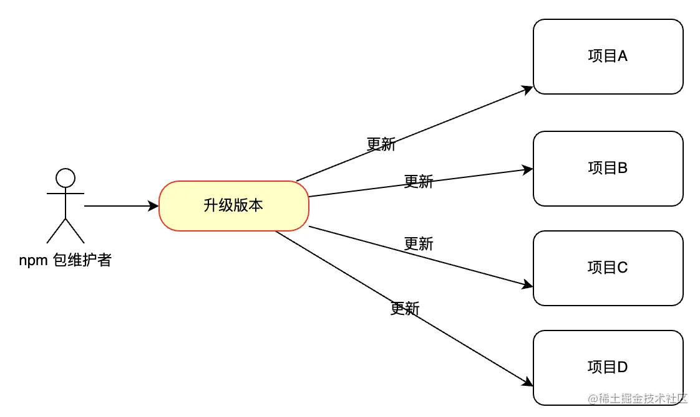

#  1.clear:true 直接配置就可以删除旧文件,webpack4要下载clean-webpack-plugin

#  2.资源处理器

在 webpack 5 之前，没有内置资源模块，所以，我们通常使用，file-loader url-loader raw-loader之类的loader去处理。

Asset Modules 它的值有四种:
 - asset/resource（对应file-loader）,将文件转化成 Webpack 能识别的资源，其他不做处理
 - asset/inline（对应url-loader）, 将文件转化成 Webpack 能识别的资源，同时小于某个大小的资源会处理成 data URI 形式
 - asset/source（对应raw-loader）、
 - asset。

```javascript
  {
        test: /\.(ttf|woff2?)$/,
        type: "asset/resource",
        generator: {
          filename: "static/media/[hash:8][ext][query]",
        },
      },
```


# 3.提供持久化缓存,在webpack 5之前，webpack是没有提供持久化缓存，我们开发的时候需要使用类似 cache-loader 来做缓存方面的处理。

```javascript
webpack4之前:
module.exports = {
  module: {
    rules: [
      {
        test: /.ext$/,
        use: ['cache-loader', ...loaders],
        include: path.resolve('src'),
      },
    ],
  },
};
```

在webpack 5中自身也加入了持久化缓存，缓存生成的 webpack 模块和 chunk，来改善构建速度。cache 会在开发 模式被设置成 type: 'memory' 而且在 生产 模式 中被禁用

```javascript


module.exports = {
  cache: {
    type: 'filesystem',
  },
};
memory表示会将打包生成的资源存放于内存中。filesystem表示开启了文件系统缓存。
```


# 4.更好的hash算法
  
  这里指的就是访问web页面时的浏览器缓存，我们也知道，之前有 hash chunckhash contenthash 在 webpack 5中，把hash改成了fullhash。

```javascript

hash/fullhash
hash/fullhash 是根据打包中的所有文件计算出来的 hash 值，在一次打包中，所有的资源出口文件的filename获得的[hash]都是一样的。

chunckhash
chunckhash顾名思义是根据打包过程中当前 chunck 计算出来的 hash 值。

contenthash
contenthash顾名思义是根据打包时的内容计算出的 hash 值。
```

webpack4对于添加注释和修改变量其实，是会影响它的一个contenthash值的计算，如果是webpack 5的话，就不会影响。


# 5.在webpack 4中，Tree Shaking 对嵌套的导出模块未使用代码无法很好进行 Tree Shaking，当然我们也可以借助一些plugin来实现，但是到了webpack 5得到了很大的改进

# 6.模块联邦 

模块联邦允许不同的Web应用程序（或微前端应用）在运行时动态共享代码，无需传统的打包或发布过程中的物理共享。
这意味着每个微应用可以独立开发、构建和部署，同时还能轻松地共享组件、库甚至是业务逻辑

只针对资源的复用与构建编译方面

在团队项目中，有AB两个项目针对于项目的一些公共模块，在进行组件/方法复用的时候，B项目抽离出公共的模块打包成npm包，通过发包的方式进行进行组件/方法的复用，当组件（方法）有一些更新时候，尤其是更改了某些存在的bug，就不得不通知依赖模块进行升版；如果存在多个依赖方，这种“发布-> 通知-> 更改”模式无疑是低效率的；



编译速度减慢:

当项目过大的时候，编译时长很长通常影响因素有很多，但是对于一些公共未改动的模块，每次进行编译都是非常浪费资源的,对于此类模块，避免重复打包是提高编译速度的重要一步

host：在页面加载过程中（当 onLoad 事件被触发）最先被初始化的 Webpack 构建；
remote：部分被 “host” 消费的另一个 Webpack 构建；
bidirectional（双向的） hosts：当一个 bundle 或者 webpack build 作为一个 host 或 remote 运行时，它要么消费其他应用，要么被其他应用消费——均发生在运行时(runtime)。

## 如何使用(ModuleFederationPlugin)

Remote（提供者模块）

```javascript
const { ModuleFederationPlugin } = require('webpack').container;
 new ModuleFederationPlugin({
      // 应用名，全局唯一，不可冲突。 
      name: "component_app",
      // 暴露的文件名称 
      filename: "remoteEntry.js",
      // 远程应用暴露出的模块名。
      exposes: {
        "./Button": "./src/Button.jsx",
        "./TimeShow": "./src/TimeShow.jsx",
      },
      // 依赖包 依赖的包 webpack在加载的时候会先判断本地应用是否存在对应的包，如果不存在，则加载远程应用的依赖包。
      shared: {
        react: {
          singleton: true
        },
        moment: {
          singleton: true
        }
      }
    }),`


```


host（使用者模块）

```javascript
 new ModuleFederationPlugin({
      //远程访问地址入口 
      remotes: {
        "component_app": "component_app@http://localhost:3001/remoteEntry.js",
        "util_app": "util_app@http://localhost:3003/remoteEntry.js",
      }, 
    }),

```
