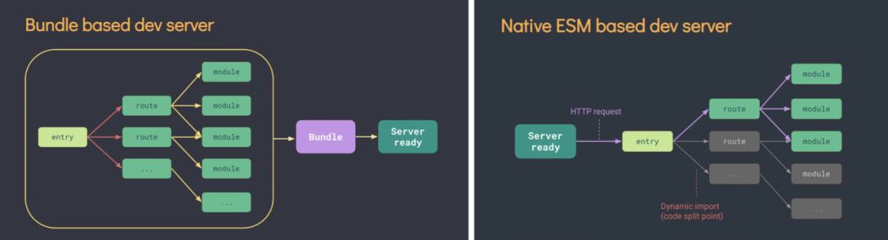

# 构建工具的作用是什么？

本质上，构建工具就是将前端源代码转换为浏览器可识别的代码。

先思考一个问题？ 前端代码是否必须通过构建才可以在浏览器中运行呢？当然不是。如下：

```
<html>
  <head>
    <title>Hello World</title>
  </head>
  <body>
    <div id="root"/>
    <script type="text/javascript">
      document.getElementById('root').innerText = 'Hello World'
    </script>
  </body>
</html>

// 上述代码，我们只需要按格式写几个 HTML 标签，插入简单的 JS 脚本，打开浏览器，一个 Hello World 的前端页面就呈现在我们面前了

```

但是当项目进入真正的实战开发，代码规模开始急速扩张后，大量逻辑混杂在一个文件之中就变得难以维护起来。即使是将不同的代码放在不同的文件中，但是这也仅仅解决了代码组织混乱的问题，还存在很多问题，比如：

1. 大量的全局变量，代码之间的依赖是不透明的，任何代码都可能悄悄的改变了全局变量。

2. 脚本的引入需要依赖特定的顺序。

后续出现过一些 IIFE、命名空间等解决方案，但是从本质上都没有解决依赖全局变量通信的问题。

# 社区模块化阶段

## AMD/CMD - 异步模块加载

为了解决浏览器端 JS 模块化的问题，出现了通过引入相关工具库的方式来解决这一问题。出现了两种应用比较广的规范及其相关库：AMD(RequireJs) 和 CMD(Sea.js)。AMD 推崇依赖前置、提前执行，CMD 推崇依赖就近、延迟执行。下面领略下相关写法

```
// RequireJs
// 加载完jquery后，将执行结果 $ 作为参数传入了回调函数
define(["jquery"], function ($) {
    $(document).ready(function(){
        $('#root')[0].innerText = 'Hello World';
    })
    return $
})


// Sea.js
// 预加载jquery
define(function(require, exports, module) {
    // 执行jquery模块，并得到结果赋值给 $
    var $ = require('jquery');
    // 调用jquery.js模块提供的方法
    $('#header').hide();
});

```

两种模块化规范实现的原理基本上是一致的，只不过各自坚持的理念不同。

两者都是以异步的方式获取当前模块所需的模块，不同的地方在于 AMD 在获取到相关模块后立即执行，CMD 则是在用到相关模块的位置再执行的。

**AMD/CMD 解决问题**

1. 手动维护代码引用顺序。从此不再需要手动调整 HTML 文件中的脚本顺序，依赖数组会自动侦测模块间的依赖关系，并自动化的插入页面。

2. 全局变量污染问题。将模块内容在函数内实现，利用闭包导出的变量通信，不会存在全局变量污染的问题

## Gulp/Grunt

在 Google Chrome 推出 V8 引擎后，基于其高性能和平台独立的特性，Nodejs 这个 JS 运行时也现世了。至此，JS 打破了浏览器的限制，拥有了文件读写的能力。Nodejs 不仅在服务器领域占据一席之地，也将前端工程化带进了正轨。

在这个背景下，第一批基于 Node.js 的构建工具出现了。

**Grunt**

Grunt 主要能够帮助我们自动化的处理一些反复重复的任务，例如压缩、编译、单元测试、linting 等

**Gulp**

Grunt 的 I/O 操作比较“呆板”，每个任务执行结束后都会将文件写入磁盘，下个任务执行时再将文件从磁盘中读出，这样的操作会产生一些问题：

1. 运行速度较慢
2. 硬件压力大

Gulp 最大特点是引入了流的概念，同时提供了一系列常用的插件去处理流，流可以在插件之间传递。同时 Gulp 设计简单，既可以单独使用，也可以结合别的工具一起使用。

## Browserify

随着 Node.js 的兴起，CommonJS 模块化规范成为了当时的主流规范。
但是我们知道 CommonJS 所使用的 require 语法是同步的，当代码执行到 require 方法的时候，必须要等这个模块加载完后，才会执行后面的代码。
这种方式在服务端是可行的，这是因为服务器只需要从本地磁盘中读取文件，速度还是很快的，但是在浏览器端，我们通过网络请求获取文件，网络环境以及文件大小都可能使页面无响应。

browserify 致力于打包产出在浏览器端可以运行的 CommonJS 规范的 JS 代码。

```
var browserify = require('browserify')
var b = browserify()
var fs = require('fs')

// 添加入口文件
b.add('./src/browserifyIndex.js')
// 打包所有模块至一个文件之中并输出bundle
b.bundle().pipe(fs.createWriteStream('./output/bundle.js'))

```

browserify 怎么实现的呢？

browserify 在运行时会通过进行 AST 语法树分析，确定各个模块之间的依赖关系，生成一个依赖字典。之后包装每个模块，传入依赖字典以及自己实现的 export 和 require 函数，最终生成一个可以在浏览器环境中执行的 JS 文件。

browserify 专注于 JS 打包，功能单一，一般配合 Gulp 一起使用。

## ESM 规范出现

在 2015 年 JavaScript 官方的模块化终于出现了，但是官方只阐述如何实现该规范，浏览器少有支持.

## Webpack

其实在 ESM 标准出现之前， webpack 已经诞生了，只是没有火起来。

webpack 的理念更偏向于工程化，伴随着 MVC 框架以及 ESM 的出现与兴起，webpack2 顺势发布，

宣布支持 AMD\CommonJS\ESM、css/less/sass/stylus、babel、TypeScript、JSX、Angular 2 组件和 vue 组件。

从来没有一个如此大而全的工具支持如此多的功能，几乎能够解决目前所有构建相关的问题。至此 webpack 真正成为了前端工程化的核心

```javascript
//webpack 是基于配置

module.exports = {
    // SPA入口文件
    entry: 'src/js/index.js',
    // 出口
    output: {
      filename: 'bundle.js'
    }
    // 模块匹配和处理 大部分都是做编译处理
    module: {
        rules: [
                    // babel转换语法
            { test: /.js$/, use: 'babel-loader' },
            //...
        ]
    },
    // 插件
    plugins: [
        // 根据模版创建html文件
        new HtmlWebpackPlugin({ template: './src/index.html' }),
    ],
}

```

webpack 要兼顾各种方案的支持，也暴露出其缺点：

1. 配置往往非常繁琐，开发人员心智负担大。
2. webpack 为了支持 cjs 和 esm，自己做了 polyfill，导致产物代码很“丑”。

### 为什么 webpack 构建产物看着很丑？

我们在使用 webpack 构建项目后，会发现打包出来的代码非常的“丑”，这是为什么？原因就是：webpack 支持多种模块规范，但是最后都会变成 commonJS 规范（webpack5 对纯 esm 做了一定的优化），但是浏览器不支持 commonJS 规范，于是 webpack 自己实现了 require 和 module.exports，所以会有很多 polyfill 代码的注入。

源代码：

```javascript
// src/index.js
let title = require('./title.js')
console.log(title);

// src/title.js
module.exports = 'bu';
```

产物代码：

```javascript
(() => {
    //把所有模块定义全部存放到modules对象里
    //属性名是模块的ID，也就是相对于根目录的相对路径，包括文件扩展名
    //值是此模块的定义函数，函数体就是原来的模块内的代码
   var modules = ({
     "./src/title.js": ((module) => {
       module.exports = 'bu';
     })
   });
   // 缓存对象
   var cache = {};

   // webpack 打包后的代码能够运行， 是因为webpack根据commonJS规范实现了一个require方法
   function require(moduleId) {
     var cachedModule = cache[moduleId];
     if (cachedModule !== undefined) {
       return cachedModule.exports;
     }
     // 缓存和创建模块对象
     var module = cache[moduleId] = {
       exports: {}
     };
     // 运行模块代码
     modules[moduleId](module, module.exports, require "moduleId");
     return module.exports;
   }
   var exports = {};
   (() => {
     // 入口相关的代码
     let title = require("./src/title.js")
     console.log(title);
   })();
 })();

```

### webpack 按需加载的模块怎么在浏览器中运行？

在实际项目开发中，随着代码越写越多，构建后的 bundle 文件也会越来越大，我们往往按照种种策略对代码进行按需加载，将某部分代码在用户事件触发后再进行加载，那么 webpack 在运行时是怎么实现的呢？

其实原理很简单，就是以 JSONP 的方式加载按需的脚本，但是如何将这些异步模块使用起来就比较有意思了～

源代码：

```javascript
// index.js
import("./hello").then((result) => {
    console.log(result.default);
});

// hello.js
export default 'hello';

```

产物代码：

```javascript
main.js

 // PS: 对代码做了部分简化及优化， 否则太难读了～～～
 // 定一个模块对象
var modules = ({});
// webpack在浏览器里实现require方法
function require(moduleId) {xxx}

/**
 * chunkIds 代码块的ID数组
 * moreModules 代码块的模块定义
*/
function webpackJsonpCallback([chunkIds, moreModules]) {
  const result = [];
  for(let i = 0 ; i < chunkIds.length ; i++){
    const chunkId = chunkIds[i];
    result.push(installedChunks[chunkId][0]);
    installedChunks[chunkId] = 0; // 表示此代码块已经下载完毕
  }

  // 将代码块合并到 modules 对象中去
  for(const moduleId in moreModules){
    modules[moduleId] = moreModules[moduleId];
  }
  //依次将require.e方法中的promise变为成功态
  while(result.length){
    result.shift()();
  }
}

// 用来存放代码块的加载状态， key是代码块的名字
// 每次打包至少产生main的代码块
// 0 表示已经加载就绪
var installedChunks = {
  "main": 0
}

require.d = (exports, definition) => {
  for (var key in definition) {
    Object.defineProperty(exports, key, { enumerable: true, get: definition[key] });
  }
};
require.r = (exports) => {
  Object.defineProperty(exports, Symbol.toStringTag, { value: 'Module' });
  Object.defineProperty(exports, '__esModule', { value: true });
};

// 给require方法定义一个m属性， 指向模块定义对象
require.m = modules;

require.f = {};

// 利用JSONP加载一个按需引入的模块
require.l = function (url) {
  let script = document.createElement("script");
  script.src = url;
  document.head.appendChild(script);
}

// 用于通过JSONP异步加载一个chunkId对应的代码块文件， 其实就是hello.main.js
require.f.j = function(chunkId, promises){
  let installedChunkData;
  // 当前代码块的数据
  const promise = new Promise((resolve, reject) => {
    installedChunkData = installedChunks[chunkId] = [resolve, reject];
  });
  promises.push(installedChunkData[2] = promise);
  // 获取模块的访问路径
  const url = chunkId + '.main.js';

  require.l(url);
}

require.e = function(chunkId) {
  let promises = [];
  require.f.j(chunkId, promises);
  console.log(promises);
  return Promise.all(promises);
}

var chunkLoadingGlobal = window['webpack'] = [];
// 由于按需加载的模块， 会在加载成功后调用此模块，所以这是JSONP的成功后的回掉
chunkLoadingGlobal.push = webpackJsonpCallback;

/**
 * require.e异步加载hello代码块文件 hello.main.js
 * promise成功后会把 hello.main.js里面的代码定义合并到require.m对象上，也就是modules上
 * 调用require方法加载./src/hello.js模块，获取 模块的导出对象，进行打印
 */
require.e('hello').then(require.bind(require, './src/hello.js')).then(result => console.log(result));

```

```javascript
//hello.main.js

"use strict";
(self["webpack"] = self["webpack"] || []).push([
  ["hello"], {
    "./src/hello.js": ((module, exports, require) => {
      require.r(exports);
      require.d(exports, {
        "default": () => (_DEFAULT_EXPORT__)
      });
      const _DEFAULT_EXPORT__ = ("hello");
    })
  }
]);

```

webpack 在产物代码中声明了一个全局变量 webpack 并赋值为一个数组，然后改写了这个数组的 push 方法。在异步代码加载完成后执行时，会调用这个 push 方法，在重写的方法内会将异步模块放到全局模块中然后等待使用。

在 webpack 出现两年后，rollup 诞生了～

## Rollup

rollup 是一款面向未来的构建工具，完全基于 ESM 模块规范进行打包，率先提出了 Tree-Shaking 的概念。并且配置简单，易于上手，成为了目前最流行的 JS 库打包工具。

```javascript
import resolve from 'rollup-plugin-node-resolve';
import babel from 'rollup-plugin-babel';

export default {
  // 入口文件
  input: 'src/main.js',
  output: {
    file: 'bundle.js',
    // 输出模块规范
    format: 'esm'
  },
  plugins: [
    // 转换commonjs模块为ESM
    resolve(),
    // babel转换语法
    babel({
      exclude: 'node_modules/**'
    })
  ]
}


rollup 基于 esm，实现了强大的 Tree-Shaking 功能，使得构建产物足够的简洁、体积足够的小。但是要考虑浏览器的兼容性问题的话，往往需要配合额外的 polyfill 库，或者结合 webpack 使用。

```

## Esbuild

在实际开发过程中，随着项目规模逐渐庞大，前端工程的启动和打包的时间也不断上升，一些工程动辄几分钟甚至十几分钟，漫长的等待，真的让人绝望。这使得打包工具的性能被越来越多的人关注。

esbuild 是一个非常新的模块打包工具，它提供了类似 webpack 资源打包的能力，但是拥有着超高的性能。

esbuild 支持 ES6/CommonJS 规范、Tree Shaking、TypeScript、JSX 等功能特性。提供了 JS API/Go API/CLI 多种调用方式.

```javascript
// JS API调用
require('esbuild').build({
    entryPoints: ['app.jsx'],
    bundle: true,
    outfile: 'out.js',
 }).catch(() => process.exit(1))

```

### 语言优势

1. esBuild 是选择 Go 语言编写的，而在 esBuild 之前，前端构建工具都是基于 Node，使用 JS 进行编写。JavaScript 是一门解释性脚本语言，即使 V8 引擎做了大量优化（JWT 及时编译），本质上还是无法打破性能的瓶颈。而 Go 是一种编译型语言，在编译阶段就已经将源码转译为机器码，启动时只需要直接执行这些机器码即可。

2. Go 天生具有多线程运行能力，而 JavaScript 本质上是一门单线程语言。esBuild 经过精心的设计，将代码 parse、代码生成等过程实现完全并行处理。

### 性能至上原则

1. esBuild 只提供现代 Web 应用最小的功能集合，所以其架构复杂度相对较小，更容易将性能做到极致

2. 在 webpack、rollup 这类工具中， 我们习惯于使用多种第三方工作来增强工程能力。比如：babel、eslint、less 等。在代码经过多个工具流转的过程中，存在着很多性能上的浪费，比如：多次进行代码 -> AST、AST -> 代码的转换。esBuild 对此类工具完全进行了定制化重写，舍弃部分可维护性，追求极致的编译性能。

3. 虽然 esBuild 性能非常高，但是其提供的功能很基础，不适合直接用到生产环境，更适合作为底层的模块构建工具，在它基础上进行二次封装。

## Vite

vite 是下一代前端开发与构建工具，提供 noBundle 的开发服务，并内置丰富的功能，无需复杂配置。

vite 在开发环境和生产环境分别做了不同的处理，在开发环境中底层基于 esBuild 进行提速，在生产环境中使用 rollup 进行打包。

为什么 vite 开发服务这么快？



- 传统 bundle based 服务：

1. 无论是 webpack 还是 rollup 提供给开发者使用的服务，都是基于构建结果的。
2. 基于构建结果提供服务，意味着提供服务前一定要构建结束，随着项目膨胀，等待时间也会逐渐变长。

- noBundle 服务：

1. 对于 vite、snowpack 这类工具，提供的都是 noBundle 服务，无需等待构建，直接提供服务。
2. 对于项目中的第三方依赖，仅在初次启动和依赖变化时重构建，会执行一个依赖预构建的过程。由于是基于 esBuild 做的构建，所以非常快。
3. 对于项目代码，则会依赖于浏览器的 ESM 的支持，直接按需访问，不必全量构建。

### 为什么在生产环境中构建使用 rollup？

1. 由于浏览器的兼容性问题以及实际网络中使用 ESM 可能会造成 RTT 时间过长，所以仍然需要打包构建。
2. esbuild 虽然快，但是它还没有发布 1.0 稳定版本，另外 esbuild 对代码分割和 css 处理等支持较弱，所以生产环境仍然使用 rollup。
3. 目前 vite 发布了 3.0 版本，相对于 2.0，修复了 400+issue，已经比较稳定，可以用于生产了。Vite 决定每年发布一个新的版本
