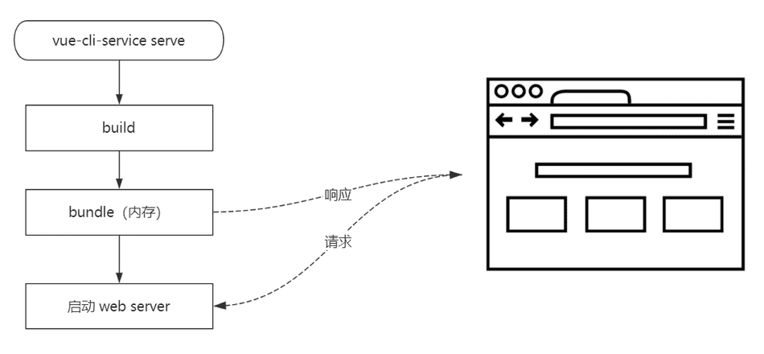
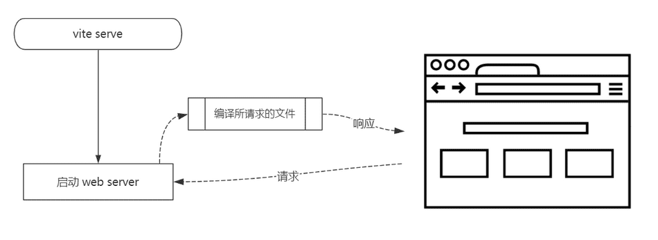
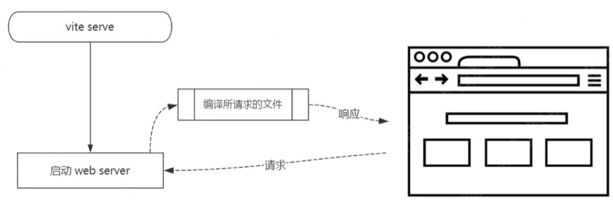
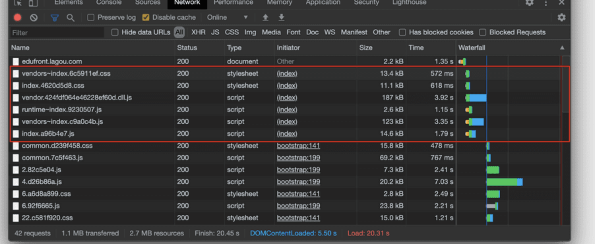
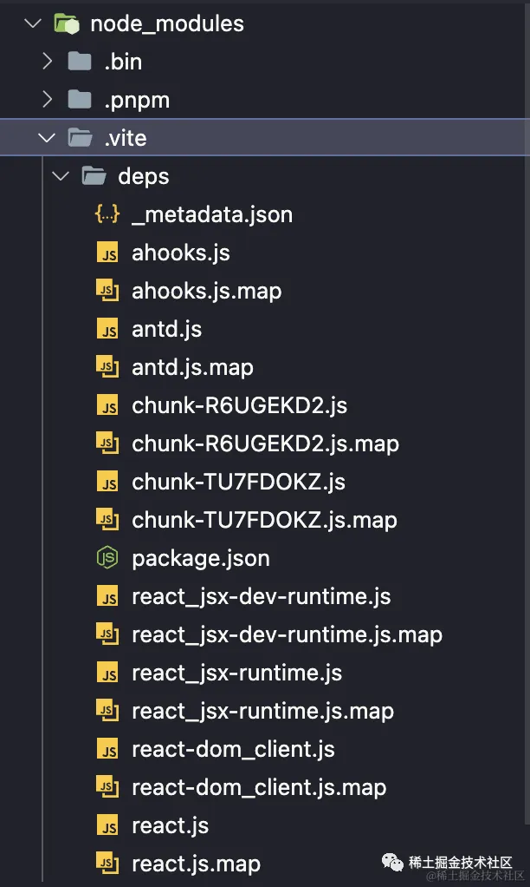
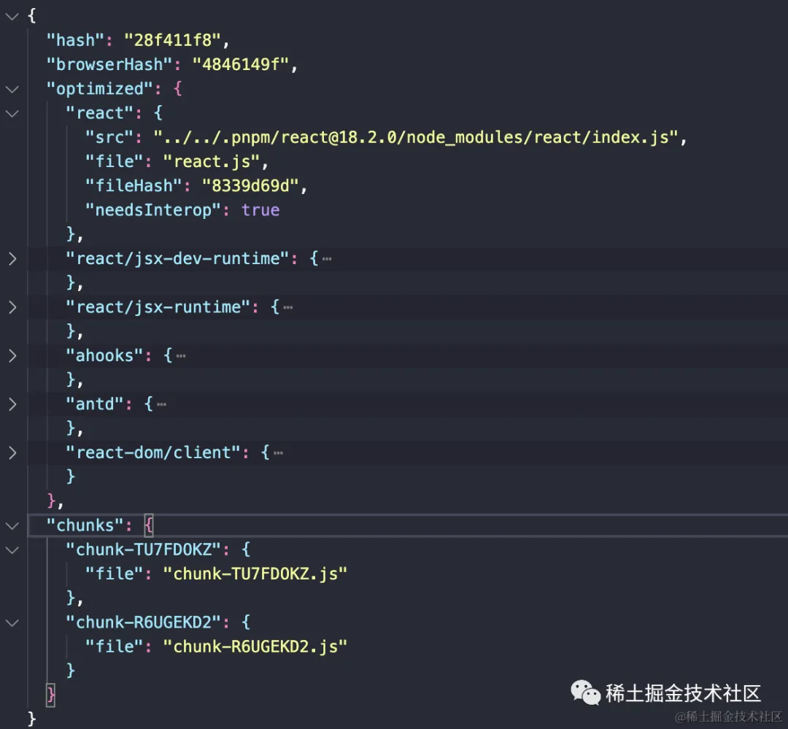
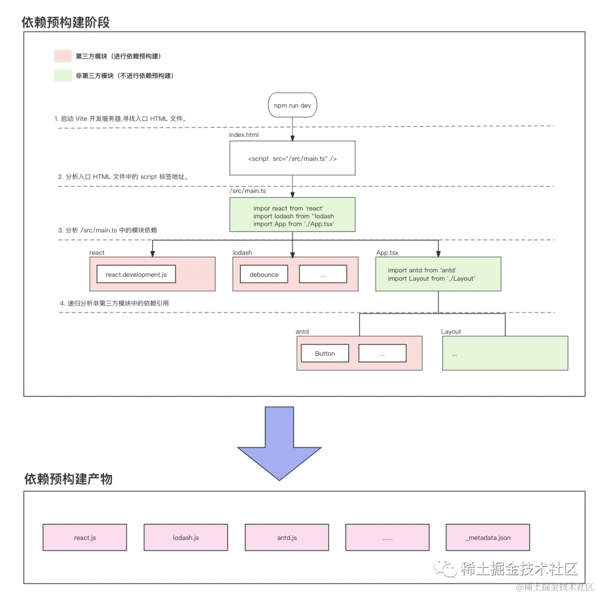
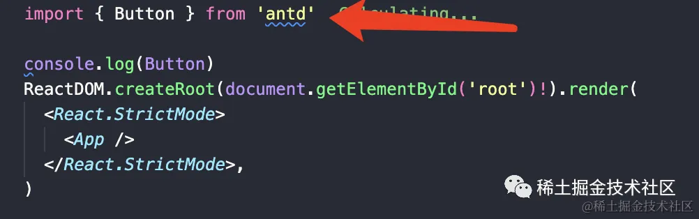
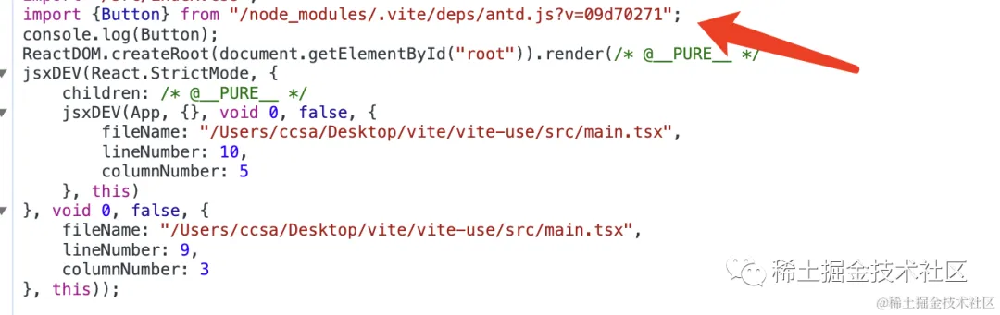

# Vite 特点

- Dev Server 无需等待，即时启动；
- 几乎实时的模块热更新；
- 所需文件按需编译，避免编译用不到的文件；
- 开箱即用，避免各种 Loader 和 Plugin 的配置；
- TypeScript - 内置支持
- less/sass/stylus/postcss - 内置支持（需要单独安装所对应的编译器）


# 快速上手

```javascript
$ npm init vite-app <project-name>
$ cd <project-name>
$ npm install
$ npm run dev

```

> npm init 或者 yarn create 是这两个包管理工具提供的新功能， 其内部就是自动去安装一个 create-<xxx> 的模块（临时），然后自动执行这个模块中的 bin。 例如: yarn create react-app my-react-app 就相当于先 yarn global add create-react-app，然后自动执行 create-react-app my-react-app

# 对比差异点

Webpack Dev Server 在启动时，需要先 build 一遍，而 build 的过程是需要耗费很多时间的。




而 Vite 则完全不同，当我们执行 vite serve 时，内部直接启动了 Web Server，并不会先编译所有的代码文件。

那仅仅是启动 Web Server，速度上自然就快了很多。



但是像 Webpack 这类工具的做法是将所有模块提前编译、打包进 bundle 里，换句话说，不管模块是否会被执行，都要被编译和打包到 bundle 里。随着项目越来越大打包后的 bundle 也越来越大，打包的速度自然也就越来越慢。

Vite 利用现代浏览器原生支持 ESM 特性，省略了对模块的打包。

对于需要编译的文件，Vite 采用的是另外一种模式：即时编译。

也就是说，只有具体去请求某个文件时才会编译这个文件。

所以，这种「即时编译」的好处主要体现在：按需编译。

# Optimize

Vite 还提供了一个目前在帮助列表中并没有呈现的一个子命令：optimize。

这个命令的作用就是单独的去「优化依赖」。

所谓的「优化依赖」，指的就是自动去把代码中依赖的第三方模块提前编译出来。

例如，我们在代码中通过 import 载入了 vue 这个模块，那通过这个命令就会自动将这个模块打包成一个单独的 ESM bundle, 放到 node_modules/.vite_opt_cache 目录中。

这样后续请求这个文件时就不需要再即时去加载了。

# HMR

同样也是模式的问题，热更新的时候，Vite 只需要立即编译当前所修改的文件即可，所以响应速度非常快。

而 Webpack 修改某个文件过后，会自动以这个文件为入口重写 build 一次，所有的涉及到的依赖也都会被加载一遍，所以反应速度会慢很多。

# Build

Vite 在生产模式下打包，需要使用 vite build 命令。

这个命令内部采用的是 Rollup 完成的应用打包，最终还是会把文件都提前编译并打包到一起。

对于 Code Splitting 需求，Vite 内部采用的就是原生 Dynamic imports 特性实现的，所以打包结果还是只能够支持现代浏览器。

不过好在 Dynamic imports 特性是可以有 Polyfill 的：https://github.com/GoogleChromeLabs/dynamic-import-polyfill ，也就是说，只要你想，它也可以运行在相对低版本的浏览器中。


#  生产环境需要打包吗

可以不打包，需要启动server，需要浏览器支持



# 打包 or 不打包

Vite 的出现，引发了另外一个值得我们思考的问题：究竟还有没有必要打包应用？

之前我们使用 Webpack 打包应用代码，使之成为一个 bundle.js，主要有两个原因：

1. 浏览器环境并不支持模块化
2. 零散的模块文件会产生大量的 HTTP 请求

随着浏览器的对 ES 标准支持的逐渐完善，第一个问题已经慢慢不存在了。现阶段绝大多数浏览器都是支持 ES Modules 的。

零散模块文件确实会产生大量的 HTTP 请求，而大量的 HTTP 请求在浏览器端就会并发请求资源的问题；



> 如上图所示，红色圈出来的请求就是并行请求，但是后面的请求就因为域名链接数已超过限制，而被挂起等待了一段时间。


在 HTTP 1.1 的标准下，每次请求都需要单独建立 TCP 链接，经过完整的通讯过程，非常耗时；

而且每次请求除了请求体中的内容，请求头中也会包含很多数据，大量请求的情况下也会浪费很多资源。

但是这些问题随着 HTTP 2 的出现，也就不复存在了。

关于 HTTP 1.1 与 HTTP 2 之间的差异，可以通过这个链接体验：https://http2.akamai.com/demo ，直观感受下 HTTP/2 比 HTTP/1 到底快了多少。

而且不打包也有一个好处，就是可以把按需加载实现到极致。


# 特性小结
Vite 带来的优势主要体现在提升开发者在开发过程中的体验。

- Dev Server 无需等待，即时启动；
- 几乎实时的模块热更新；
- 所需文件按需编译，避免编译用不到的文件；
- 开箱即用，避免各种 Loader 和 Plugin 的配置；

# 实现原理

Vite 的核心功能：`Static Server` + `Compile` + `HMR`

核心思路：

1. 将当前项目目录作为静态文件服务器的根目录
2. 拦截部分文件请求
3. 处理代码中 import node_modules 中的模块
4. 处理 vue 单文件组件（SFC）的编译
5. 通过 WebSocket 实现 HMR

# 为什么 Vite 可以让代码直接运行在浏览器上？

前文我们提到，在开发环境时，我们使用 vite 开发，是无需打包的，直接利用浏览器对 ESM 的支持，就可以访问我们写的组件代码，但是一些组件代码文件往往不是 JS 文件，而是 .ts、.tsx、.vue 等类型的文件。这些文件浏览器肯定直接是识别不了的，vite 在这个过程中做了些什么？

```javascript
// index.html
<!DOCTYPE html>
<html lang="en">
  <head>
    <meta charset="UTF-8" />
    <link rel="icon" type="image/svg+xml" href="/vite.svg" />
    <meta name="viewport" content="width=device-width, initial-scale=1.0" />
    <title>Vite + Vue</title>
  </head>
  <body>
    <div id="app"></div>
    <script type="module" src="/src/main.js"></script>
  </body>
</html>

// /src/main.js
import { createApp } from 'vue'
import App from './App.vue'
createApp(App).mount('#app');

// src/App.vue
<template>
  <h1>Hello</h1>
</template>

```

在浏览器中打开页面后，会发现浏览器对入口文件发起了请求：


我们可以观察到 vue 这个第三方包的访问路径改变了，变成了node_modules/.vite下的一个 vue 文件，这里真正访问的文件就是前面我们提到的，vite 会对第三方依赖进行依赖预构建所生成的缓存文件。

另外浏览器也对 App.vue 发起了访问，相应内容是 JS：


返回内容（做了部分简化，移除了一些热更新的代码）：

```javascript
 const _sfc_main = {
    name: 'App'
}
// vue 提供的一些API，用于生成block、虚拟DOM
import { openBlock as _openBlock, createElementBlock as _createElementBlock } from "/node_modules/.vite/vue.js?v=b618a526"

function _sfc_render(_ctx, _cache, $props, $setup, $data, $options) {
    return (_openBlock(), _createElementBlock("h1", null, "App"))
}
// 组件的render方法
_sfc_main.render = _sfc_render;
export default _sfc_main;

```

总结：当用户访问 vite 提供的开发服务器时，对于浏览器不能直接识别的文件，服务器的一些中间件会将此类文件转换成浏览器认识的文件，从而保证正常访问。

# Vite 为什么启动非常快

- 开发环境使用Es6 Module，无需打包，非常快
- 生产环境使用rollup，并不会快很多


# 手写实现

详细参考 https://github.com/zce/vite-essentials


```javascript
#!/usr/bin/env node

const path = require('path')
const { Readable } = require('stream')
const Koa = require('koa')
const send = require('koa-send')
const compilerSfc = require('@vue/compiler-sfc')

const cwd = process.cwd()

const streamToString = stream =>
  new Promise((resolve, reject) => {
    const chunks = []
    stream.on('data', chunk => chunks.push(chunk))
    stream.on('end', () => resolve(Buffer.concat(chunks).toString('utf8')))
    stream.on('error', reject)
  })

const app = new Koa()

// 重写请求路径，/@modules/xxx => /node_modules/
app.use(async (ctx, next) => {
  if (ctx.path.startsWith('/@modules/')) {
    const moduleName = ctx.path.substr(10) // => vue
    const modulePkg = require(path.join(cwd, 'node_modules', moduleName, 'package.json'))
    ctx.path = path.join('/node_modules', moduleName, modulePkg.module)
  }
  await next()
})

// 根据请求路径得到相应文件 /index.html
app.use(async (ctx, next) => {
  // ctx.path // http://localhost:3080/
  // ctx.body = 'my-vite'
  await send(ctx, ctx.path, { root: cwd, index: 'index.html' }) // 有可能还需要额外处理相应结果
  await next()
})

// .vue 文件请求的处理，即时编译
app.use(async (ctx, next) => {
  if (ctx.path.endsWith('.vue')) {
    const contents = await streamToString(ctx.body)
    const { descriptor } = compilerSfc.parse(contents)
    let code

    if (ctx.query.type === undefined) {
      code = descriptor.script.content
      code = code.replace(/export\s+default\s+/, 'const __script = ')
      code += `
  import { render as __render } from "${ctx.path}?type=template"
  __script.render = __render
  export default __script`
      // console.log(code)
      ctx.type = 'application/javascript'
      ctx.body = Readable.from(Buffer.from(code))
    } else if (ctx.query.type === 'template') {
      const templateRender = compilerSfc.compileTemplate({
        source: descriptor.template.content
      })
      code = templateRender.code
    }

    ctx.type = 'application/javascript'
    ctx.body = Readable.from(Buffer.from(code))
  }
  await next()
})

// 替换代码中特殊位置
app.use(async (ctx, next) => {
  if (ctx.type === 'application/javascript') {
    const contents = await streamToString(ctx.body)
    ctx.body = contents
      .replace(/(from\s+['"])(?![\.\/])/g, '$1/@modules/')
      .replace(/process\.env\.NODE_ENV/g, '"production"')
  }
})

app.listen(3080)

console.log('Server running @ http://localhost:3080')

```

# 预构建

所谓依赖预构建指的是在 DevServer 启动之前，Vite 会扫描使用到的依赖从而进行构建，之后在代码中每次导入(import)时会动态地加载构建过的依赖这一过程

也许大多数同学对于 Vite 的认知更多是 No Bundle，但上述的依赖预构建过程的确像是 Bundle 的过程。

简单来说，Vite 在一开始将应用中的模块区分为 「依赖」 和 「源码」 两类：

- 「依赖部分」 更多指的是代码中使用到的第三方模块，比如 vue、lodash、react 等。

Vite 将会使用 `esbuild` 在应用启动时对于依赖部分进行预构建依赖。

-「源码部分」 比如说平常我们书写的一个一个 js、jsx、vue 等文件，这部分代码会在运行时被编译，并不会进行任何打包。

Vite 以 原生 ESM 方式提供源码。这实际上是让浏览器接管了打包程序的部分工作：Vite 只需要在浏览器请求源码时进行转换并按需提供源码。根据情景动态导入代码，即只在当前屏幕上实际使用时才会被处理。

我们在文章中接下来要聊到的「依赖预构建」，其实更多是针对于第三方模块的预构建过程

我们在使用 vite 启动项目时，细心的同学会发现项目 node_modules 目录下会额外增加一个 `node_modules/.vite/deps` 的目录：




这个目录就是 vite 在开发环境下预编译的产物。

项目中的「依赖部分」：ahooks、antd、react 等部分会被预编译成为一个一个 .js 文件。

同时，`.vite/deps` 目录下还会存在一个` _metadata.json`



_metadata.json 中存在一些特殊属性：

- hash
- browserHash
- optimized
- chunks

简单来说 vite 在预编译时会对于项目中使用到的第三方依赖进行依赖预构建，将构建后的产物存放在 `node_modules/.vite/deps` 目录中，比如 ahooks.js、react.js 等。

同时，预编译阶段也会生成一个`_metadata.json` 的文件用来保存预编译阶段生成文件的映射关系(optimized 字段)，方便在开发环境运行时重写依赖路径。

上边的概念大家也不需要过于在意，现在不清楚也没关系。我们只需要清楚，依赖预构建的过程简单来说就是生成 node_modules/deps 文件即可。


## 为什么需要预构建

那么为什么需要预构建呢？

1. 首先第一点，我们都清楚 Vite 是基于浏览器 Esmodule 进行模块加载的方式。

那么，对于一些非 ESM 模块规范的第三方库，比如 react。在开发阶段，我们需要借助预构建的过程将这部分非 esm 模块的依赖模块转化为 esm 模块。从而在浏览器中进行 import 这部分模块时也可以正确识别该模块语法。

2. 另外一个方面，同样是由于 Vite 是基于 Esmodule 这一特性。在浏览器中每一次 import 都会发送一次请求，部分第三方依赖包中可能会存在许多个文件的拆分从而导致发起多次 import 请求。

比如 lodash-es 中存在超过 600 个内置模块，当我们执行 import { debounce } from 'lodash' 时，如果不进行预构建浏览器会同时发出 600 多个 HTTP 请求，这无疑会让页面加载变得明显缓慢。

正式通过依赖预构建，将 lodash-es 预构建成为单个模块后仅需要一个 HTTP 请求就可以解决上述的问题。

基于上述两点，Vite 中正是为了「模块兼容性」以及「性能」这两方面大的原因，所以需要进行依赖预构建。


## 思路导图

那么，预构建究竟是怎么样的过程？我们先来看一幅关于依赖预构建的思维导图



在开始后续的内容之前，我们先来简单和大家聊聊这张图中描述的各个关键步骤。

1. 调用 npm run dev(vite) 启动开发服务器。首先，当我们在 vite 项目中首次启动开发服务器时，默认情况下（未指定 build.rollupOptions.input/optimizeDeps.entries 情况下），Vite 抓取项目目录下的所有的(config.root) .html 文件来检测需要预构建的依赖项（忽略了node_modules、build.outDir、__tests__ 和 coverage）。

>❝
>通常情况下，单个项目我们仅会使用单个 index.html 作为入口文件。
>❞


2. 分析 index.html 入口文件内容。其次，当首次运行启动命令后。Vite 会寻找到入口 HTML 文件后会分析该入口文件中的 <script> 标签寻找引入的 js/ts 资源（图中为 /src/main.ts）。

3. 分析 /src/main.ts 模块依赖 之后，会进入 /src/main.ts 代码中进行扫描，扫描该模块中的所有 import 导入语句。这一步主要会将依赖分为两种类型从而进行不同的处理方式：

 - 对于源码中引入的第三方依赖模块，比如 lodash、react 等第三方模块。Vite 会在这个阶段将导入的第三方依赖的入口文件地址记录到内存中，简单来说比如当碰到 import antd from 'antd'时 Vite 会记录 { antd: '/Users/19Qingfeng/Desktop/vite/vite-use/node_modules/antd/es/index.js' }，同时会将第三方依赖当作外部(external)进行处理（并不会递归进入第三方依赖进行扫描）。

- 对于模块源代码，就比如我们在项目中编写的源代码。Vite 会依次扫描模块中所有的引入，对于非第三方依赖模块会再次递归进入扫描。

4. 递归分析非第三方模块中的依赖引用 同时，在扫描完成 /src/main.ts 后，Vite 会对于该模块中的源码模块进行递归分析。这一步会重新进行第三步骤，唯一不同的是扫描的为 /src/App.tsx。

最终，经过上述步骤 Vite 会从入口文件出发扫描出项目中所有依赖的第三方依赖，同时会存在一份类似于如下的映射关系表：

```javascript
 {
        "antd": {
            // key 为引入的第三方依赖名称，value 为该包的入口文件地址
            "src": "/Users/19Qingfeng/Desktop/vite/vite-use/node_modules/antd/es/index.js"
        }，
        // ...
    }
```

5. 生产依赖预构建产物

经过上述的步骤，我们已经生成了一份源码中所有关于第三方导入的依赖映射表。最后，Vite 会根据这份映射表调用 EsBuild 对于扫描出的所有第三方依赖入口文件进行打包。将打包后的产物存放在 node_modules/.vite/deps 文件中。比如，源码中导入的 antd 最终会被构建为一个单独的 antd.js 文件存放在 node_modules/.vite/deps/antd.js 中。


简单来说，上述的 5 个步骤就是 Vite 依赖预构建的过程。

有些同学可能会好奇，预构建生成这样的文件怎么使用呢？

这个问题其实和这篇文章关系并不是很大，本篇文章中着重点更多是和让大家了解预构建是在做什么以及是怎么实现的过程。

简单来说，预构建对于第三方依赖生成 node_modules/.vite/deps 资源后。在开发环境下 vite 会“拦截”所有的 ESM 请求，将源码中对于第三方依赖的请求地址重写为我们预构建之后的资源产物，比如我们在源码中编写的 antd 导入



最终在开发环境下 Vite 会将对于第三方模块的导入路径重新为:



其实 import { Button } from '/node_modules/.vite/deps/antd.js?v=09d70271' 这个地址正是我们将 antd 在预构建阶段通过 Esbuild 在 /node_modules/.vite/deps 生成的产物。

至于 Vite 在开发环境下是如何重写这部分第三方导入的地址这件事，我们会在下一篇关于实现 Vite 的文章会和大家详细讲解

# 模块联邦 ？？？
