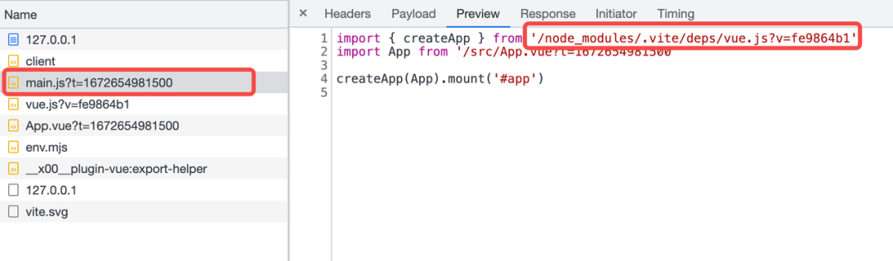
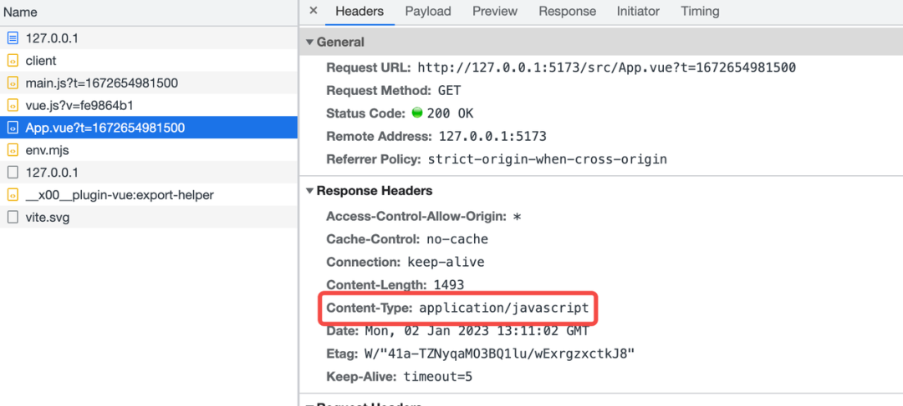

# 为什么 Vite 可以让代码直接运行在浏览器上？

前文我们提到，在开发环境时，我们使用 vite 开发，是无需打包的，直接利用浏览器对 ESM 的支持，就可以访问我们写的组件代码，但是一些组件代码文件往往不是 JS 文件，而是 .ts、.tsx、.vue 等类型的文件。这些文件浏览器肯定直接是识别不了的，vite 在这个过程中做了些什么？

```
// index.html
<!DOCTYPE html>
<html lang="en">
  <head>
    <meta charset="UTF-8" />
    <link rel="icon" type="image/svg+xml" href="/vite.svg" />
    <meta name="viewport" content="width=device-width, initial-scale=1.0" />
    <title>Vite + Vue</title>
  </head>
  <body>
    <div id="app"></div>
    <script type="module" src="/src/main.js"></script>
  </body>
</html>

// /src/main.js
import { createApp } from 'vue'
import App from './App.vue'
createApp(App).mount('#app');

// src/App.vue
<template>
  <h1>Hello</h1>
</template>

```

在浏览器中打开页面后，会发现浏览器对入口文件发起了请求：



我们可以观察到 vue 这个第三方包的访问路径改变了，变成了node_modules/.vite下的一个 vue 文件，这里真正访问的文件就是前面我们提到的，vite 会对第三方依赖进行依赖预构建所生成的缓存文件。

另外浏览器也对 App.vue 发起了访问，相应内容是 JS：



返回内容（做了部分简化，移除了一些热更新的代码）：

```
 const _sfc_main = {
    name: 'App'
}
// vue 提供的一些API，用于生成block、虚拟DOM
import { openBlock as _openBlock, createElementBlock as _createElementBlock } from "/node_modules/.vite/vue.js?v=b618a526"

function _sfc_render(_ctx, _cache, $props, $setup, $data, $options) {
    return (_openBlock(), _createElementBlock("h1", null, "App"))
}
// 组件的render方法
_sfc_main.render = _sfc_render;
export default _sfc_main;

```

总结：当用户访问 vite 提供的开发服务器时，对于浏览器不能直接识别的文件，服务器的一些中间件会将此类文件转换成浏览器认识的文件，从而保证正常访问。