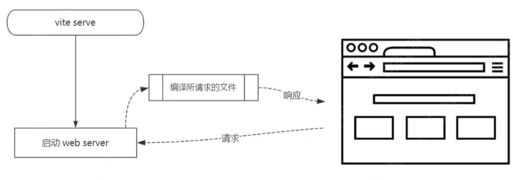

# Vite 特点

- Dev Server 无需等待，即时启动；
- 几乎实时的模块热更新；
- 所需文件按需编译，避免编译用不到的文件；
- 开箱即用，避免各种 Loader 和 Plugin 的配置；

## 开箱即用

- TypeScript - 内置支持
- less/sass/stylus/postcss - 内置支持（需要单独安装所对应的编译器）

##  生产环境需要打包吗

可以不打包，需要启动server，需要浏览器支持

# Vite 为什么启动非常快

- 开发环境使用Es6 Module，无需打包，非常快
- 生产环境使用rollup，并不会快很多

