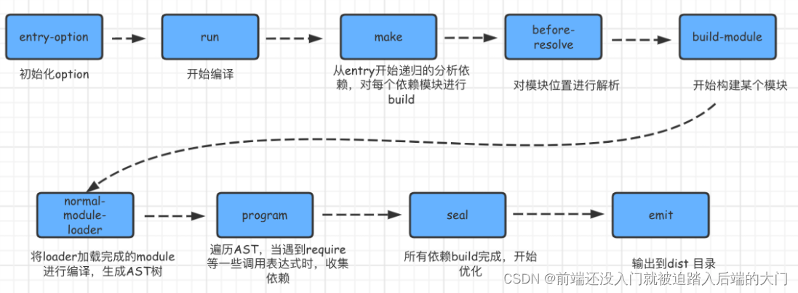
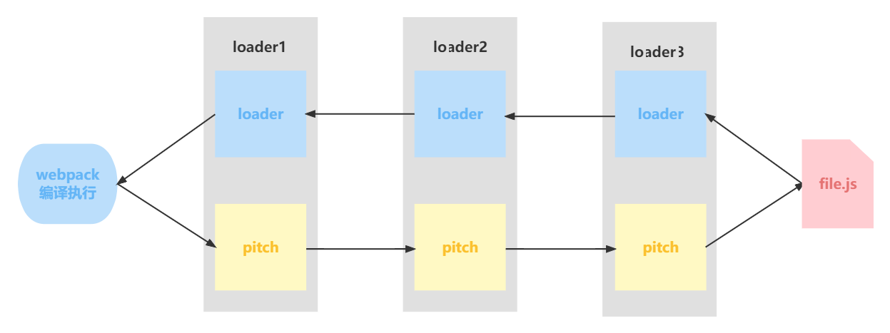
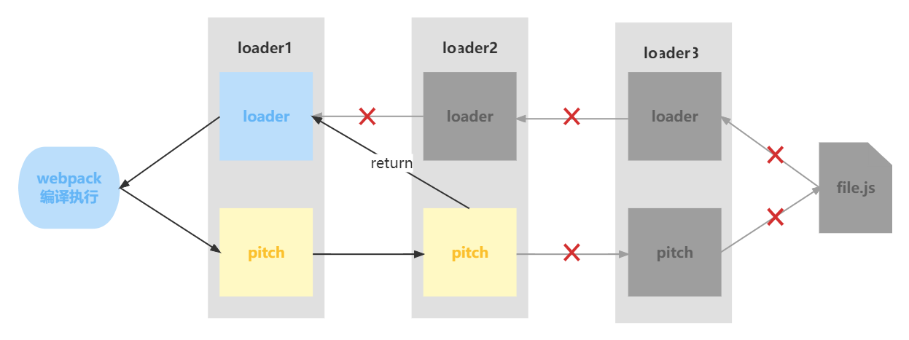

# webpack 介绍

webpack 是一个用于现代 JavaScript 应用程序的静态模块打包工具。我们可以使用 webpack 管理模块。

因为在 webpack 看来，项目中的所有资源皆为模块，通过分析模块间的依赖关系，在其内部构建出一个依赖图，最终编绎输出模块为 HTML、JavaScript、CSS 以及各种静态文件（图片、字体等），让我们的开发过程更加高效。

五大要素：Entry 、Output、Loader、Plugin、Mode

# 功能

- 模块打包。可以将不同模块的文件打包整合在一起，并且保证它们之间的引用正确，执行有序。利用打包我们就可以在开发的时候根据我们自己的业务自由划分文件模块，保证项目结构的清晰和可读性。

- 编译兼容。在前端的“上古时期”，手写一堆浏览器兼容代码一直是令前端工程师头皮发麻的事情，而在今天这个问题被大大的弱化了，通过 webpack 的 Loader 机制，不仅仅可以帮助我们对代码做 polyfill，还可以编译转换诸如.less，.vue，.jsx 这类在浏览器无法识别的格式文件，让我们在开发的时候可以使用新特性和新语法做开发，提高开发效率。

- 能力扩展。通过 webpack 的 Plugin 机制，我们在实现模块化打包和编译兼容的基础上，可以进一步实现诸如按需加载，代码压缩等一系列功能，帮助我们进一步提高自动化程度，工程效率以及打包输出的质量。

# webpack 的构建流程？

webpack 的运行流程是一个串行的过程，从启动到结束会依次执行以下流程：



1. 初始化参数：从配置文件和 Shell 语句中读取与合并参数，得出最终的参数
2. 开始编译：用上一步得到的参数初始化 Compiler 对象，加载所有配置的插件，执行对象的 run 方法开始执行编译
3. 确定入口：根据配置中的 entry 找出所有的入口文件
4. 编译模块：从入口文件出发，调用所有配置的 loader 对模块进行翻译，再找出该模块依赖的模块，再递归本步骤直到所有入口依赖的文件都经过了本步骤的处理
5. 完成模块编译：在经过上一步使用 loader 翻译完所有模块后，得到了每个模块被翻译后的最终内容以及它们之间的依赖关系
6. 输出资源(seal方法)：根据入口和模块之间的依赖关系，组装成一个个包含多个模块的 Chunk，再把每个 Chunk 转换成一个单独的文件加入到输出列表，这步是可以修改输出内容的最后机会
7. 输出完成（钩子emit执行）：在确定好输出内容后，根据配置确定输出的路径和文件名，把文件内容写入到文件系统

在以上过程中，webpack 会在特定的时间点广播出特定的事件，插件在监听到感兴趣的事件后会执行特定的逻辑，并且插件可以调用 webpack 提供的 API 改变 webpack 的运行结果。

简单说：
初始化：启动构建，读取与合并配置参数，加载 Plugin，实例化 Compiler
编译：从 entry 出发，针对每个 Module 串行调用对应的 loader 去翻译文件的内容，再找到该 Module 依赖的 Module，递归地进行编译处理
输出：将编译后的 Module 组合成 Chunk，将 Chunk 转换成文件，输出到文件系统中

## 构建流程核心概念：

Tapable：一个基于发布订阅的事件流工具类，Compiler 和 Compilation 对象都继承于 Tapable

Compiler：compiler对象是一个全局单例，他负责把控整个webpack打包的构建流程。在编译初始化阶段被创建的全局单例，包含完整配置信息、loaders、plugins以及各种工具方法

Compilation：代表一次 webpack 构建和生成编译资源的的过程，在watch模式下每一次文件变更触发的重新编译都会生成新的 Compilation 对象，包含了当前编译的模块 module, 编译生成的资源，变化的文件, 依赖的状态等

区别:

Compiler 全局唯一，且从启动生存到结束；
Compilation对应每次编译，每轮编译循环均会重新创建；


而每个模块间的依赖关系，则依赖于AST语法树。每个模块文件在通过Loader解析完成之后，会通过acorn库生成模块代码的AST语法树，通过语法树就可以分析这个模块是否还有依赖的模块，进而继续循环执行下一个模块的编译解析。
最终Webpack打包出来的bundle文件是一个IIFE的执行函数。

# webpack原理

Webpack主要使用Compiler和Compilation两个类来控制Webpack的整个生命周期。他们都继承了Tapabel并且通过Tapabel来注册了生命周期中的每一个流程需要触发的事件

## Tapabel
Tapabel是一个类似于 Node.js 的 EventEmitter的库，主要是控制钩子函数的发布与订阅，是Webpack插件系统的大管家

Tapabel提供的钩子及示例

Tapable库为插件提供了很多 Hook以便挂载。

```javascript
const {
    SyncHook,                   // 同步钩子
    SyncBailHook,               // 同步熔断钩子
    SyncWaterfallHook,          // 同步流水钩子
    SyncLoopHook,               // 同步循环钩子
    AsyncParalleHook,           // 异步并发钩子
    AsyncParallelBailHook,      // 异步并发熔断钩子
    AsyncSeriesHook,            // 异步串行钩子
    AsyncSeriesBailHook,        // 异步串行熔断钩子
    AsyncSeriesWaterfallHook     // 异步串行流水钩子
} = require("tapable");

```

Tabpack 提供了同步&异步绑定钩子的方法，方法如下所示：

Async	                        Sync
绑定：tapAsync/tapPromise/tap	绑定：tap
执行：callAsync/promise	        执行：call|

Tabpack简单示例

```javascript
const demohook = new SyncHook(["arg1", "arg2", "arg3"]);
// 绑定事件到webpack事件流
demohook.tap("hook1",(arg1, arg2, arg3) => console.log(arg1, arg2, arg3)) // 1 2 3
// 执行绑定的事件
demohook.call(1,2,3)

```

## 源码解读
1. 初始化启动之Webpack的入口文件

- 追本溯源，第一步我们要找到Webpack的入口文件。
- 当通过命令行启动Webpack后，npm会让命令行工具进入`node_modules.bin` 目录。
- 然后查找是否存在 webpack.sh 或者 webpack.cmd 文件，如果存在，就执行它们，不存在就会抛出错误。
- 实际的入口文件是：`node_modules/webpack/bin/webpack.js`，让我们来看一下里面的核心函数。

```javascript
// node_modules/webpack/bin/webpack.js
// 正常执行返回
process.exitCode = 0;    
// 运行某个命令                               
const runCommand = (command, args) => {...}
// 判断某个包是否安装
const isInstalled = packageName => {...}
// webpack可用的CLI：webpacl-cli和webpack-command
const CLIs = {...}
// 判断是否两个CLI是否安装了
const installedClis = CLIs.filter(cli=>cli.installed);
// 根据安装数量进行处理
if (installedClis.length === 0) {...} else if 
 (installedClis.length === 1) {...} else {...}

```

启动后，Webpack最终会找到 webpack-cli /webpack-command的 npm 包，并且 执行 CLI。

2. webpack-cli

搞清楚了Webpack启动的入口文件后，接下来让我们把目光转移到webpack-cli，看看它做了哪些事儿。

引入 yargs，对命令行进行定制分析命令行参数，对各个参数进行转换，组成编译配置项引用webpack，根据配置项进行编译和构建
webpack-cli 会处理不需要经过编译的命令。

```javascript
// node_modules/webpack-cli/bin/cli.js
const {NON_COMPILATION_ARGS} = require("./utils/constants");
const NON_COMPILATION_CMD = process.argv.find(arg => {
    if (arg === "serve") {
        global.process.argv = global.process.argv.filter(a => a !== "serve");
        process.argv = global.process.argv;
    }
    return NON_COMPILATION_ARGS.find(a => a === arg);
});
if (NON_COMPILATION_CMD) {
    return require("./utils/prompt-command")(NON_COMPILATION_CMD,...process.argv);
}

```

webpack-cli提供的不需要编译的命令如下

```javascript
// node_modules/webpack-cli/bin/untils/constants.js
const NON_COMPILATION_ARGS = [
    "init",                 // 创建一份webpack配置文件
    "migrate",              // 进行webpack版本迁移
    "add",                  // 往webpack配置文件中增加属性
    "remove",               // 往webpack配置文件中删除属性
    "serve",                // 运行webpack-serve
    "generate-loader",      // 生成webpack loader代码
    "generate-plugin",      // 生成webpack plugin代码
    "info"                  // 返回与本地环境相关的一些信息
];

```

webpack-cli 使用命令行工具包yargs

```javascript
// node_modules/webpack-cli/bin/config/config-yargs.js
const {
    CONFIG_GROUP,
    BASIC_GROUP,
    MODULE_GROUP,
    OUTPUT_GROUP,
    ADVANCED_GROUP,
    RESOLVE_GROUP,
    OPTIMIZE_GROUP,
    DISPLAY_GROUP
} = GROUPS;

```

- webpack-cli对配置文件和命令行参数进行转换最终生成配置选项参数 options，最终会根据配置参数实例化webpack对象，然后执行构建流程。
- 除此之外，让我们回到node_modules/webpack/lib/webpack.js里来看一下Webpack还做了哪些准备工作。

```javascript
// node_modules/webpack/lib/webpack.js
const webpack = (options, callback) => {
    ...
    options = new WebpackOptionsDefaulter().process(options);
    compiler = new Compiler(options.context);
    new NodeEnvironmentPlugin().apply(compiler);
    ...
    compiler.options = new WebpackOptionsApply().process(options, compiler);
    ...
    webpack.WebpackOptionsDefaulter = WebpackOptionsDefaulter;
    webpack.WebpackOptionsApply = WebpackOptionsApply;
    ...
    webpack.NodeEnvironmentPlugin = NodeEnvironmentPlugin;
}


```

`WebpackOptionsDefaulter`的功能是设置一些默认的Options(代码比较多不贴了，大家自行查看node_modules/webpack/lib/WebpackOptionsDefaulter.js)

```javascript
// node_modules/webpack/lib/node/NodeEnvironmentPlugin.js
class NodeEnvironmentPlugin {
  apply(compiler) {
      ...		
      compiler.hooks.beforeRun.tap("NodeEnvironmentPlugin", compiler => {
	  if (compiler.inputFileSystem === inputFileSystem) inputFileSystem.purge();
      });
  }
}


```

从上面的代码我们可以知道，NodeEnvironmentPlugin插件监听了beforeRun钩子，它的作用是清除缓存

3. WebpackOptionsApply

`WebpackOptionsApply`会将所有的配置options参数转换成webpack内部插件。

使用默认插件列表

- output.library -> LibraryTemplatePlugin
- externals -> ExternalsPlugin
- devtool -> EvalDevtoolModulePlugin, SourceMapDevToolPlugin
- AMDPlugin, CommonJsPlugin
- RemoveEmptyChunksPlugin

```javascript
// node_modules/webpack/lib/WebpackOptionsApply.js
new EntryOptionPlugin().apply(compiler);
compiler.hooks.entryOption.call(options.context, options.entry);

```

实际上，插件最后都会变成compiler对象上的实例。

4. EntryOptionPlugin

下来让我们进入EntryOptionPlugin插件，看看它做了哪些事儿。

```javascript
// node_modules/webpack/lib/EntryOptionPlugin.js
module.exports = class EntryOptionPlugin {
    apply(compiler) {
        compiler.hooks.entryOption.tap("EntryOptionPlugin", (context, entry) => {
	    if (typeof entry === "string" || Array.isArray(entry)) {
	        itemToPlugin(context, entry, "main").apply(compiler);
	    } else if (typeof entry === "object") {
	        for (const name of Object.keys(entry)) {
		    itemToPlugin(context, entry[name], name).apply(compiler);
	        }
	    } else if (typeof entry === "function") {
	        new DynamicEntryPlugin(context, entry).apply(compiler);
	    }
	    return true;
	});
    }
};


```

- 如果是数组，则转换成多个entry来处理，如果是对象则转换成一个个entry来处理。

- compiler实例化是在node_modules/webpack/lib/webpack.js里完成的。通过EntryOptionPlugin插件进行参数校验。通过WebpackOptionsDefaulter将传入的参数和默认参数进行合并成为新的options，创建compiler，以及相关plugin，最后通过

- WebpackOptionsApply将所有的配置options参数转换成Webpack内部插件。
  
- 再次来到我们的node_modules/webpack/lib/webpack.js中

```javascript
if (options.watch === true || (Array.isArray(options) && options.some(o => o.watch))) {
  const watchOptions = Array.isArray(options)
	? options.map(o => o.watchOptions || {})
	: options.watchOptions || {};
	return compiler.watch(watchOptions, callback);
}
compiler.run(callback);

```

> 实例compiler后会根据options的watch判断是否启动了watch，如果启动watch了就调用compiler.watch来监控构建文件，否则启动compiler.run来构建文件。

### 编译构建
compile

首先会实例化NormalModuleFactory和ContextModuleFactory。然后进入到run方法。

```javascript
// node_modules/webpack/lib/Compiler.js
run(callback) { 
    ...
    // beforeRun 如上文NodeEnvironmentPlugin插件清除缓存
    this.hooks.beforeRun.callAsync(this, err => {
        if (err) return finalCallback(err);
        // 执行run Hook开始编译
        this.hooks.run.callAsync(this, err => {
            if (err) return finalCallback(err);
            this.readRecords(err => {
                if (err) return finalCallback(err);
                // 执行compile
                this.compile(onCompiled);
            });
        });
    });
}
```

> 在执行this.hooks.compile之前会执行this.hooks.beforeCompile，来对编译之前需要处理的插件进行执行。紧接着this.hooks.compile执行后会实例化Compilation对象

```javascript
// node_modules/webpack/lib/compiler.js
compile(callback) {
    const params = this.newCompilationParams();
    this.hooks.beforeCompile.callAsync(params, err => {
	if (err) return callback(err);
	// 进入compile阶段
	this.hooks.compile.call(params);
	const compilation = this.newCompilation(params);
	// 进入make阶段
	this.hooks.make.callAsync(compilation, err => {
	    if (err) return callback(err);
	    compilation.finish(err => {
		if (err) return callback(err);
		// 进入seal阶段
		compilation.seal(err => {
		    if (err) return callback(err);
		    this.hooks.afterCompile.callAsync(compilation, err => {
			if (err) return callback(err);
			return callback(null, compilation);
		    })
 		})
	    })
	})
    })
}

```

#### make

- 一个新的Compilation创建完毕，将从Entry开始读取文件，根据文件类型和配置的Loader对文件进行编译，编译完成后再找出该文件依赖的文件，递归的编译和解析。
- 我们来看一下make钩子被监听的地方。
- 如代码中注释所示，addEntry是make构建阶段真正开始的标志

```javascript
// 从文档可知, make 是 AsyncParallelHook, 也就是异步并行钩子, 特点就是异步任务同时执行
// 可以使用 tap、tapAsync、tapPromise 注册。
// node_modules/webpack/lib/SingleEntryPlugin.js
compiler.hooks.make.tapAsync(
    "SingleEntryPlugin",
    (compilation, callback) => {
	const { entry, name, context } = this;
	cosnt dep = SingleEntryPlugin.createDependency(entry, name);
	// make构建阶段开始标志 
	compilation.addEntry(context, dep, name, callback);
    }
)

```

> addEntry实际上调用了_addModuleChain方法，_addModuleChain方法将模块添加到依赖列表中去，同时进行模块构建。构建时会执行如下函数

```javascript
// node_modules/webpack/lib/Compilation.js
// addEntry -> addModuleChain
_addModuleChain(context, dependency, onModule, callback) {
...
this.buildModule(module, false, null, null, err => {
	...
})
...
}
```

> 如果模块构建完成，会触发finishModules

```javascript
// node_modules/webpack/lib/Compilation.js
finish(callback) {
    const modules = this.modules;
    this.hooks.finishModules.callAsync(modules, err => {
        if (err) return callback(err);
	for (let index = 0; index < modules.length; index++) {
	    const module = modules[index];			
            this.reportDependencyErrorsAndWarnings(module, [module]);
        }
        callback();
    })
}

```


1. Module

Module包括NormalModule(普通模块)、ContextModule(./src/a ./src/b)、ExternalModule(module.exports=jQuery)、DelegatedModule(manifest)以及MultiModule(entry:['a', 'b'])。
本文以NormalModule(普通模块)为例子，看一下构建(Compilation)的过程。
使用 loader-runner 运行 loadersLoader转换完后，使用 acorn 解析生成AST使用 ParserPlugins 添加依赖

2. loader-runner

```javascript
// node_modules/webpack/lib/NormalModule.js
const { getContext, runLoaders } = require("loader-runner");
doBuild(){
    ...
    runLoaders(
        ...
    )
    ...
}
...
try {
    const result = this.parser.parse()
}

```

doBuild会去加载资源，doBuild中会传入资源路径和插件资源去调用loader-runner插件的runLoaders方法去加载和执行loader

3. acorn

```javascript
// node_modules/webpack/lib/Parser.jsconst acorn = require("acorn");
```

使用acorn解析转换后的内容，输出对应的抽象语法树(AST)。

```javascript
// node_modules/webpack/lib/Compilation.js
this.hooks.buildModule.call(module);
...
if (error) {
    this.hooks.failedModule.call(module, error);
    return callback(error);
}
this.hooks.succeedModule.call(module);
return callback();

```

- 成功就触发succeedModule，失败就触发failedModule。
- 最终将上述阶段生成的产物存放到Compilation.js的this.modules = [];上。

完成后就到了seal阶段。

这里补充介绍一下Chunk生成的算法

4. Chunk生成算法

- webpack首先会将entry中对应的module都生成一个新的chunk。
- 遍历module的依赖列表，将依赖的module也加入到chunk中。
- 如果一个依赖module是动态引入的模块，会根据这个module创建一个新的chunk，继续遍历依赖。
- 重复上面的过程，直至得到所有的chunk。

### seal

- 所有模块及其依赖的模块都通过Loader转换完成，根据依赖关系开始生成Chunk。
- seal阶段也做了大量的的优化工作，进行了hash的创建以及对内容进行生成(createModuleAssets)。

```javascript
// node_modules/webpack/lib/Compilation.jsthis.createHash();
this.modifyHash();
this.createModuleAssets();

```

```javascript
// node_modules/webpack/lib/Compilation.js
createModuleAssets(){
    for (let i = 0; i < this.modules.length; i++) {
	const module = this.modules[i];
	if (module.buildInfo.assets) {
	    for (const assetName of Object.keys(module.buildInfo.assets)) {
		const fileName = this.getPath(assetName);
		this.assets[fileName] = module.buildInfo.assets[assetName];
		this.hooks.moduleAsset.call(module, fileName);
	    }
	}
    }
}

```

seal阶段经历了很多的优化，比如tree shaking就是在这个阶段执行。最终生成的代码会存放在Compilation的assets属性上

### emit

emit是异步串行钩子，要用tapAsync监听。

将输出的内容输出到磁盘，创建目录生成文件，文件生成阶段结束。

```javascript
// node_modules/webpack/lib/compiler.js
this.hooks.emit.callAsync(compilation, err => {
    if (err) return callback(err);
    outputPath = compilation.getPath(this.outputPath);
    this.outputFileSystem.mkdirp(outputPath, emitFiles);
})

```

### 总结

Webpack在启动阶段对配置参数和命令行参数以及默认参数进行了合并，并进行了插件的初始化工作。完成初始化的工作后调用Compiler的run开启Webpack编译构建过程，构建主要流程包括compile、make、build、seal、emit等阶段。


# loader

默认情况下，webpack 只支持对 js 和 json 文件进行打包，但是像 css、html、png 等其他类型的文件，webpack 则无能为力。因此，就需要配置相应的 loader 进行文件内容的解析转换。

loader的作用就是帮助 webpack 将不同类型的文件转换为 webpack 可识别的模块。

## loader 特性

- loader 可以是同步的，也可以是异步的
- loader 运行在 Node.js 中，并且能够执行任何操作
- 除了常见的通过 package.json的 main来将一个npm 模块导出为 loader，还可以在module.rules 中使用 loader 字段直接引用一个模块
- 插件(plugin)可以为 loader 带来更多特性
- loader 能够产生额外的任意文件

## 常用的 loader 如下：

- image-loader：加载并且压缩图片文件。
- style-loader：用于将 CSS 编译完成的样式，挂载到页面的 style 标签上。需要注意 loader 执行顺序，`style-loader 要放在第一位，loader 都是从后往前执行`。
- MiniCssExtractPlugin.loader: 取代styleloader，作用：提取js中的css成单独文件。
- css-loader：加载 CSS，支持模块化、压缩、文件导入等特性，使用 css-loader 必须要配合使用 style-loader。
- postcss-loader：扩展 CSS 语法，使用下一代 CSS，可以配合 `autoprefixer` 插件自动补齐 CSS3 前缀。
 ```javascript
     {
            loader: "postcss-loader",
            options: {
              postcssOptions: {
                plugins: [
                  "postcss-preset-env", // 能解决大多数样式兼容性问题
                ],
              },
            },
          },,
 // 兼容性可以在package.json中配置
{
  // 其他省略
    "browserslist": ["last 2 version", "> 1%", "not dead"]
}
 ```
                         
- less-loader： 加载并编译 LESS 文件。
- sass-loader：加载并编译 SASS/SCSS 文件。
- babel-loader：把 ES6 转换成 ES5， 兼容性处理
- eslint-loader：通过 ESLint 检查 JavaScript 代码。
- vue-loader：加载并编译 Vue 组件。
- file-loader：把文件输出到一个文件夹中，在代码中通过相对 URL 去引用输出的文件 (处理`图片`和`字体`,比如`iconfont`之类的)
- url-loader：与 `file-loader` 类似，区别是用户可以设置一个阈值，大于阈值会交给 `file-loader` 处理，`小于阈值时返回文件 base64` 形式编码 (处理图片和字体)
  在webpack5中可以直接使用内置资源来处理


## loader 执行顺序

```javascript

pre： 前置 loader
normal： 普通 loader (没有指定enforce的就是normal)
inline： 内联 loader
post： 后置 loader

- 执行顺序

loader 的执行优级为：`pre > normal > inline > post `。
相同优先级的 loader 执行顺序为：`从右到左，从下到上`。因为 webpack 中是采用 Compose 的执行方式，而不是pipe的方式而已，Compose 是从右向左执行

```
> 以前我看网上关于为什么 loader 执行顺序是从左到右的面试题，都说是因为 webpack 内部是通过 compose 进行 plugins 的链式调用。
> 直到我自己去看了源码，发现根本没有使用 compose，而是因为上面提到的 pitching loader，webpack 通过一个 loaderIndex 字段去记录当前执行到了哪个 loader：按> 照正常习惯先从左到右执行 pitching loader，loaderIndex 递增；然后从右到左执行 normal loader，loaderIndex 递减。并且 pitch 方法如果有返回值的话可以忽略> 后面(右边的) loader 的结果

> 作者：o翔哥o
> 链接：https://juejin.cn/post/7342400998857031695
> 来源：稀土掘金
> 著作权归作者所有。商业转载请联系作者获得授权，非商业转载请注明出处。


```javascript
// 此时loader执行顺序：loader1 - loader2 - loader3
module: {
  rules: [
    {
      enforce: "pre",
      test: /\.js$/,
      loader: "loader1",
    },
    {
      // 没有enforce就是normal
      test: /\.js$/,
      loader: "loader2",
    },
    {
      enforce: "post",
      test: /\.js$/,
      loader: "loader3",
    },
  ],
},
```

- inline loader

用法：`import Styles from 'style-loader!css-loader?modules!./styles.css';`

含义：

使用 `css-loader` 和 `style-loader` 处理 `styles.css` 文件

通过 ! 将资源中的 loader 分开
inline loader 可以通过添加不同前缀，跳过其他类型 loader。

! 跳过 normal loader。
`import Styles from '!style-loader!css-loader?modules!./styles.css';`

-! 跳过 pre 和 normal loader。
`import Styles from '-!style-loader!css-loader?modules!./styles.css';`

!! 跳过 pre、 normal 和 post loader。
`import Styles from '!!style-loader!css-loader?modules!./styles.css';`


## 自定义loader

```javascript
module.exports = function loader1(content, map, meta) {
  console.log("hello loader");
  return content;
};

content 源文件的内容
map SourceMap 数据
meta 数据，可以是任何内容
```

## loader分类

1. 同步loader

```javascript
// 第一种写法，直接返回
module.exports = function (content, map, meta) {
  return content;
};

// 第二种写法，通过callback,更灵活，允许传递多个参数，不仅仅是content
module.exports = function (content, map, meta) {
  /*
    第一个参数：err 代表是否有错误
    第二个参数：content 处理后的内容
    第三个参数：source-map 继续传递source-map
    第四个参数：meta 给下一个loader传递参数
  */
  this.callback(null, content, map, meta);
  return; // 当调用 callback() 函数时，总是返回 undefined
};
```

2. 异步loader

> 由于同步计算过于耗时，在 Node.js 这样的单线程环境下进行此操作并不是好的方案，我们建议尽可能地使你的 loader 异步化。但如果计算量很小，同步 loader 也是可以的。

```javascript
module.exports = function (content, map, meta) {
  const callback = this.async();
  // 进行异步操作
  setTimeout(() => {
    callback(null, result, map, meta);
  }, 1000);
};
```


3. Raw Loader 

默认情况下，资源文件会被转化为 UTF-8 字符串，然后传给 loader。通过设置 raw 为 true，loader 可以接收原始的 Buffer。

```javascript
module.exports = function (content) {
  // content是一个Buffer数据
  return content;
};
module.exports.raw = true; // 开启 Raw Loader
```

4. Pitching Loader

```javascript
module.exports = function (content) {
  return content;
};
module.exports.pitch = function (remainingRequest, precedingRequest, data) {
  console.log("do somethings");
};
```
webpack 会先`从左到右`执行 loader 链中的每个 loader 上的 `pitch` 方法（如果有），然后再`从右到左`执行 loader 链中的每个 loader 上的普通 loader 方法。



在这个过程中如果任何 pitch 有返回值，则 loader 链被阻断。webpack 会跳过后面所有的的 pitch 和 loader，直接进入上一个 loader 。




## banner-loader

```javascript
const schema = require("./schema.json");

module.exports = function (content) {
  // 获取loader的options，同时对options内容进行校验
  // schema是options的校验规则（符合 JSON schema 规则）
  const options = this.getOptions(schema);

  const prefix = `
    /*
    * Author: ${options.author}
    */
  `;

  return `${prefix} \n ${content}`;
};
// loaders/banner-loader/schema.json
{
  "type": "object",
  "properties": {
    "author": {
      "type": "string"
    }
  },
  "additionalProperties": false
}
```

## clean-log-loader

```javascript
// loaders/clean-log-loader.js
module.exports = function cleanLogLoader(content) {
  // 将console.log替换为空
  return content.replace(/console\.log\(.*\);?/g, "");
};

```


# plugin

webpack 中的 plugin 赋予其各种灵活的功能，例如`打包优化`、`资源管理`、`环境变量注入`等，它们会运行在 webpack 的不同阶段（钩子 / 生命周期），贯穿了 webpack 整个编译周期。目的在于解决 loader 无法实现的其他事。

## plugin特性

其本质是一个具有 `apply` 方法 `javascript` 对象。apply 方法会被 `webpack compiler `调用，并且在整个编译生命周期都可以访问 `compiler` 对象

站在代码逻辑的角度就是：webpack 在编译代码过程中，会触发一系列 `Tapable` 钩子事件，插件所做的，就是找到相应的钩子，往上面挂上自己的任务，也就是注册事件，这样，当 webpack 构建的时候，插件注册的事件就会随着钩子的触发而执行了

```javascript
const pluginName = 'ConsoleLogOnBuildWebpackPlugin';
class ConsoleLogOnBuildWebpackPlugin {
 apply(compiler) {
 compiler.hooks.run.tap(pluginName, (compilation) => {
 console.log('webpack ');
 });
 }
}
module.exports = ConsoleLogOnBuildWebpackPlugin;

```

关于整个编译生命周期钩子，有如下:
- entry-option:初始化 option
- run
- compile:真正开始的编译，在创建 compilation 对象之前compilation:生成好了 compilation 对象
- make 从 entry 开始递归分析依赖，准备对每个模块进行 build。after-compile:编译 build 过程结束
- emit :在将内存中 assets 内容写到磁盘文件夹之前
- after-emit :在将内存中 assets 内容写到磁盘文件夹之后
- done:完成所有的编译过程
- failed:编译失败的时候

## Compiler
compiler 对象中保存着完整的 Webpack 环境配置，每次启动 webpack 构建时它都是一个独一无二，仅仅会创建一次的对象。

这个对象会在首次启动 Webpack 时创建，我们可以通过 compiler 对象上访问到 Webapck 的主环境配置，比如 loader 、 plugin 等等配置信息。

它有以下主要属性：

- compiler.options 可以访问本次启动 webpack 时候所有的配置文件，包括但不限于 loaders 、 entry 、 output 、 plugin 等等完整配置信息。
- compiler.inputFileSystem 和 compiler.outputFileSystem 可以进行文件操作，相当于 Nodejs 中 fs。
- compiler.hooks 可以注册 tapable 的不同种类 Hook，从而可以在 compiler 生命周期中植入不同的逻辑。

## 常用的 plugin 如下：

- HtmlWebpackPlugin：简化 HTML 文件创建 (依赖于 html-loader).`默认会创建一个空的 HTML，自动引入打包输出的所有资源（JS/CSS）`，还可以进行配置压缩html代码
    ```javascript
     new HtmlWebpackPlugin({
    template: './src/index.html',
    // 压缩 html 代码
    minify: {
    // 移除空格
    collapseWhitespace: true,
    // 移除注释
    removeComments: true
    }
    })
    ```
- mini-css-extract-plugin: 分离样式文件，CSS 提取为独立文件，支持按需加载 (替代 extract-text-webpack-plugin)。
                           因为不用这个的话，js文件加载会创建一个style标签生成样式，会出现闪屏 现象，用户体验不好。
                           我们应该是单独的 Css 文件，通过 link 标签加载性能才好。
- OptimizeCssAssetsWebpackPlugin： 压缩css
- compression-webpack-plugin: 提供带 Content-Encoding 编码的压缩版的资源,gzip压缩与欧冠
- clean-webpack-plugin: 目录清理
- Banner-plugin: 在每个生成的chunk顶部添加banner
- CopyWebpackPlugin: 将单个文件或整个目录复制到构建目录
- IgnorePlugin：`new webpack.IgnorePlugin(/^\.\/locale$/, /moment$/)`
- webpack-bundle-analyzer:分析
- speed-measure-webpack-plugin：编译时间
- SplitChunksPlugin

> webpack 把 chunk 分为两种类型，一种是初始加载initial chunk，另外一种是异步加载 async chunk，如果不配置SplitChunksPlugin，webpack会在production的模式下自动开启，默认情况下，webpack会将 node_modules 下的所有模块定义为异步加载模块，并分析你的 entry、动态加载（import()、require.ensure）模块，找出这些模块之间共用的node_modules下的模块，并将这些模块提取到单独的chunk中，在需要的时候异步加载到页面当中，其中默认配置如下

# loader 和 plugin 的区别？

- loader 是文件加载器，能够加载资源文件，并对这些文件进行一些处理，诸如编译、压缩等，最终一起打包到指定的文件中；
- plugin 赋予了 webpack 各种灵活的功能，例如打包优化、资源管理、环境变量注入等，目的是解决 loader 无法实现的其他事。
- 在运行时机上，`loader 运行在打包文件之前；plugin 则是在整个编译周期都起作用。`
- 在配置上，loader 在 module.rules 中配置，作为模块的解析规则，类型为数组。每一项都是一个 Object，内部包含了 test(类型文件)、loader、options (参数)等属性；plugin 在 plugins 中单独配置，类型为数组，每一项是一个 plugin 的实例，参数都通过构造函数传入。

# webpack的热更新原理是？

- Webpack-complier：Webpack 的编译器，将 Javascript 编译成 bundle（就是最终的输出文件）
- HMR Server：将热更新的文件输出给 HMR Runtime
- Bunble Server：静态资源文件服务器，提供文件在浏览器的访问，也就是我们平时能够正常通过 localhost 访问我们本地网站的原因
- HMR Runtime：开启了热更新的话，在打包阶段会被注入到浏览器中的 bundle.js，这样 bundle.js 就可以跟服务器建立连接，通常是使用 Websocket ，当收到服务器的更新指令的时候，就去更新文件的变化
- bundle.js：构建输出的文件
- HRM Runtime和HMR Server建立websokcer,实时更新文件变化


## 启动阶段为上图 1 - 2 - A - B

- 在编写未经过webpack打包的源代码后，Webpack Compile 将源代码和 HMR Runtime 一起编译成 bundle文件，传输给Bundle Server 静态资源服务器

## 更新阶段为上图 1 - 2 - 3 - 4

当某一个文件或者模块发生变化时，webpack监听到文件变化对文件重新编译打包，编译生成唯一的hash值，这个hash值用来作为下一次热更新的标识

根据变化的内容生成两个补丁文件：manifest（包含了 hash 和 chundId，用来说明变化的内容）和chunk.js 模块
由于socket服务器在HMR Runtime 和 HMR Server之间建立 websocket链接，当文件发生改动的时候，服务端会向浏览器推送一条消息，消息包含文件改动后生成的hash值，如下图的h属性，作为下一次热更细的标识


在浏览器接受到这条消息之前，浏览器已经在上一次 socket 消息中已经记住了此时的 hash 标识,这时候我们会创建一个 ajax去服务端请求获取到变化内容的 manifest 文件mainfest 文件包含重新 build 生成的 hash 值，以及变化的模块，对应上图的c 属性浏览器根据 manifest 文件获取模块变化的内容，从而触发 render 流程，实现局部模块更新


## 总结

Webpack 热更新的大致原理是，文件经过 Webpack-complier 编译好后传输给 HMR Server，HMR Server 知道哪个资源 (模块) 发生了改变，并通知 HMR Runtime 有哪些变化，HMR Runtime 就会更新我们的代码，这样浏览器就会更新并且不需要刷新。

而 Webpack 热更新机制主要耗时点在于，Webpack 的热更新会以当前修改的文件为入口重新 build 打包，所有涉及到的依赖也都会被重新加载一次。

关于 webpack 热模块更新的总结如下:

- 通过 webpack-dev-server 创建两个服务器:提供静态资源的服务(express)和Socket服务
- express server 负责直接提供静态资源的服务(打包后的资源直接被浏览器请求和解析)
- socket server 是一个 websocket 的长连接，双方可以通信
- 当socket server 监听到对应的模块发生变化时，会生成两个文件,json(manifest文件)和.js文件(update chunk)
- 通过长连接，socket server 可以直接将这两个文件主动发送给客户端(浏览器)
- 浏览器拿到两个新的文件后，通过HMR runtime机制，加载这两个文件，并且针对修改的模块进行更新


## Manifest

首先需要了解一下Manifest，它是webpack维护的一份用于管理构建过程中所有模块及关联关系的数据表，包含了各个模块之间的依赖关系、模块内容等详细信息，是webpack解析和加载模块的重要依据。


上图是webpack 配合 webpack-dev-server 进行应用开发的模块热更新流程图，记录了完整的更新流程。

上图底部红色框内是服务端，而上面的橙色框是浏览器端。
绿色的方框是 webpack 代码控制的区域。蓝色方框是 webpack-dev-server 代码控制的区域，洋红色的方框是文件系统，文件修改后的变化就发生在这，而青色的方框是应用本身。

上图显示了修改代码到模块热更新完成的一个周期（步骤已使用序号标出），流程如下：

1. webpack 对文件系统进行 watch 打包到内存中。在 webpack 的 watch 模式下，文件系统中某一个文件发生修改，webpack 监听到文件变化，根据配置文件对模块重新编译打包，并将打包后的代码通过简单的 JavaScript 对象保存在内存中（文件写在内存中，速度更快，性能更高，使用memory-fs工具完成）。

2. webpack-dev-server 和 webpack 之间的接口交互。而在这一步，主要是 dev-server 的中间件 `webpack-dev-middleware` 和 webpack 之间的交互，webpack-dev-middleware 调用 webpack 暴露的 API对代码变化进行监控，并且告诉 webpack，将代码打包到内存中。

```javascript
//webpack-dev-server/lib/Server.js
setupDevMiddleware() {
    this.middleware = webpackDevMiddleware(
        this.compiler,
        Object.assign({}, this.options, { logLevel: this.log.options.level })
    );
}
// webpack-dev-middleware/index.js
if (!options.lazy) {
    context.watching = compiler.watch(options.watchOptions, (err) => {
    ...
    });
}
```
以上代码可以看出，webpack-dev-middleware 是通过调用 webpack 的 api 对文件系统 watch 的。watchOptions 如果没有配置的话，会取默认值。值的含义见：https://webpack.js.org/configuration/watch/


3. webpack-dev-server 对文件变化的一个监控。这一步不同于第一步，并不是监控代码变化重新打包。当我们在配置文件中配置了devServer.watchContentBase 为 true 的时候，Server 会监听这些配置文件夹中静态文件的变化，变化后会通知浏览器端对应用进行 live reload。注意，这儿是浏览器刷新，和 HMR 是两个概念。

4. webpack-dev-server 代码的工作。该步骤主要是通过 sockjs（webpack-dev-server 的依赖）在浏览器端和服务端之间建立一个 websocket 长连接，将 webpack 编译打包的各个阶段的状态信息告知浏览器端，同时也包括第三步中 Server 监听静态文件变化的信息。浏览器端根据这些 socket 消息进行不同的操作。当然服务端传递的最主要信息还是新模块的 hash 值，后面的步骤根据这一 hash 值来进行模块热替换。

5. webpack-dev-server/client 端并不能够请求更新的代码，也不会执行热更模块操作，而把这些工作又交回给了 webpack，webpack/hot/dev-server 的工作就是根据 webpack-dev-server/client 传给它的信息以及 dev-server 的配置决定是刷新浏览器呢还是进行模块热更新。当然如果仅仅是刷新浏览器，也就没有后面那些步骤了。

6. HotModuleReplacement.runtime 是客户端 HMR 的中枢，它接收到上一步传递给他的新模块的 hash 值，它通过 JsonpMainTemplate.runtime 向 server 端发送 Ajax 请求，服务端返回一个 json，该 json 包含了所有要更新的模块的 hash 值，获取到更新列表后，该模块再次通过 jsonp 请求，获取到最新的模块代码。这就是上图中 7、8、9 步骤。

7. 而第 10 步是决定 HMR 成功与否的关键步骤，在该步骤中，HotModulePlugin 将会对新旧模块进行对比，决定是否更新模块，在决定更新模块后，检查模块之间的依赖关系，更新模块的同时更新模块间的依赖引用。

8. 最后一步，当 HMR 失败后，回退到 live reload 操作，也就是进行浏览器刷新来获取最新打包代码。

如上就是热更新的过程，当然这只是webpack所做的工作，此时业务代码中并不能知道代码是否发生变化，我们必须使用前面提到的accept方法来进行监听，并实现对应的变化相应操作。

```dotnetcli
if(module.hot) { // 先判断是否开启HMR
    module.hot.accept('./xxx.js', function() {
        // do something
    })
}
```

# tree shaking的原理是什么？

Tree Shaking 是一个术语，在计算机中表示消除死代码，依赖于 ES Module 的静态语法分析(不执行任何的代码，可以明确知道模块的依赖关系)

Tree shaking 的原理主要是基于静态分析的方式来实现无用代码的消除，从而减小最终打包生成的文件体积。它的工作原理可以简要概括如下：

- 采用 ES6 Module 语法：Tree shaking 只对 ES6 Module 语法进行静态分析和优化。ES6 Module 的特点是可以进行静态分析，这意味着在`编译阶段就能够确定模块之间的依赖关系`。
- 静态分析模块依赖：在编译过程中，通过静态分析可以确定每个模块的依赖关系，以及模块中导出的函数、变量等信息。
- 标记未被引用的代码：在静态分析的过程中，会标记出那些未被其他模块引用的函数、变量和代码块。
- 消除未被引用的代码：在构建过程中，根据静态分析得到的标记信息，可以对未被引用的代码进行消除。这样，在最终生成的打包文件中，未被引用的代码将不会包含在内。

需要注意的是，`Tree-shaking 并不是指 Webpack 中的某一个配置选项，而是一组功能搭配使用过后实现的效果，这组功能在生产模式下都会自动启用，`所以使用生产模式打包就会有 Tree-shaking 的效果。

在 webpack 实现 Trss shaking 有两种不同的方案:

##  usedExports:通过标记某些函数是否被使用，之后通过Terser来进行优化的。

```javascript
module.exports = {
 ...
 optimization:{
 // 模块只导出被使用的成员
    usedExports:true,
 // 压缩输出结果
    minimize: true
 }
}
```
使用之后，没被用上的代码在 webpack 打包中会加入unused harmony export mul 注释，用来告知 Terser 在优化时，可以删除掉这段代码
如下面 sum 函数没被用到，webpack 打包会添加注释，terser 在优化时，则将该函数去掉

如果把我们的代码看成一棵大树，那你就可以这样理解：

- usedExports 的作用就是标记树上哪些是枯树枝、枯树叶；
- minimize 的作用就是负责把枯树枝、枯树叶摇下来

### 合并模块 

除了 usedExports 选项之外，我们还可以使用一个 `concatenateModules` 选项继续优化输出。

普通打包只是将一个模块最终放入一个单独的函数中，如果我们的模块很多，就意味着在输出结果中会有很多的模块函数。

`concatenateModules` 配置的作用就是尽可能将所有模块合并到一起输出到一个函数中，这样既提升了运行效率，又减少了代码的体积。

我们回到配置文件中，这里我们在 `optimization` 属性中开启 `concatenateModules`。同时，为了更好地看到效果，我们先关闭 minimize，具体配置如下

```javascript
// ./webpack.config.js
/** @type {import('webpack').Configuration} */
module.exports = {
  // ... 其他配置项
  optimization: {
    // 模块只导出被使用的成员
    usedExports: true,
    // 尽可能合并每一个模块到一个函数中
    concatenateModules: true,
    // 压缩输出结果
    minimize: false
  }
}

```

然后回到命令行终端再次运行打包。那此时 bundle.js 中就不再是一个模块对应一个函数了，而是把所有的模块都放到了一个函数中，具体结果如下：


这个特性又被称为 Scope Hoisting，也就是作用域提升，它是 Webpack 3.0 中添加的一个特性。

如果再配合 minimize 选项，打包结果的体积又会减小很多。


## sideEffects:跳过整个模块/文件，直接查看该文件是否有副作用两种不同的配置方案， 有不同的效果


> 模块的副作用指的就是模块执行的时候除了导出成员，是否还做了其他的事情。

这个特性一般只有我们去开发一个 npm 模块时才会用到。因为官网把对 sideEffects 特性的介绍跟 Tree-shaking 混到了一起，所以很多人误认为它们之间是因果关系，个人观点，它们其实没有什么太大的关系。

我们先把 sideEffects 特性本身的作用弄明白，你就更容易理解为什么说它跟 Tree-shaking 没什么关系了

Tree-shaking 只能移除没有用到的代码成员，而想要完整移除没有用到的模块，那就需要开启 sideEffects 特性了。

```javascript
// ./webpack.config.js
/** @type {import('webpack').Configuration} */
module.exports = {
  mode: 'none',
  entry: './src/main.js',
  output: {
    filename: 'bundle.js'
  },
  optimization: {
    sideEffects: true // 这个特性在 production 模式下同样会自动开启。
  }
}

```


sideEffects 用于告知 webpack compiler 哪些模块时有副作用，配置方法是在 package.json中设置 sideEffects 属性
如果 sideEffects 设置为false，就是告知 webpack 可以安全的删除未用到的 exports如果有些文件需要保留，可以设置为数组的形式


那此时 Webpack 在打包某个模块之前，会先检查这个模块所属的 package.json 中的 sideEffects 标识，以此来判断这个模块是否有副作用，如果没有副作用的话，这些没用到的模块就不再被打包。换句话说，即便这些没有用到的模块中存在一些副作用代码，我们也可以通过 package.json 中的 sideEffects 去强制声明没有副作用。

那我们打开项目 package.json 添加一个 sideEffects 字段，把它设置为 false，具体代码如下：

```javascript
{
  "name": "09-side-effects",
  "version": "0.1.0",
  "author": "zce <w@test.me> (https://test.me)",
  "license": "MIT",
  "scripts": {
    "build": "webpack"
  },
  "devDependencies": {
    "webpack": "^4.43.0",
    "webpack-cli": "^3.3.11"
  },
  "sideEffects": false
}

```
这样就表示我们这个项目中的所有代码都没有副作用，让 Webpack 放心大胆地去“干”。

完成以后我们再次运行打包，然后同样找到打包输出的 bundle.js 文件，结果如下：

此时那些没有用到的模块就彻底不会被打包进来了。那这就是 sideEffects 的作用。

这里设置了两个地方：

- webpack.config.js 中的 sideEffects 用来开启这个功能；
- package.json 中的 sideEffects 用来标识我们的代码没有副作用。

目前很多第三方的库或者框架都已经使用了 sideEffects 标识，所以我们再也不用担心为了一个小功能引入一个很大体积的库了。例如，某个 UI 组件库中只有一两个组件会用到，那只要它支持 sideEffects，你就可以放心大胆的直接用了。


## 结合 babel-loader 的问题

很多资料中都表示“为 JS 模块配置 babel-loader，会导致 Tree-shaking 失效”

针对这个问题，这里我统一说明一下：

首先你需要明确一点：Tree-shaking 实现的前提是 ES Modules，也就是说：最终交给 Webpack 打包的代码，必须是使用 ES Modules 的方式来组织的模块化。

为什么这么说呢？

我们都知道 Webpack 在打包所有的模块代码之前，先是将模块根据配置交给不同的 Loader 处理，最后再将 Loader 处理的结果打包到一起。

很多时候，我们为了更好的兼容性，会选择使用 babel-loader (opens new window)去转换我们源代码中的一些 ECMAScript 的新特性。而 Babel 在转换 JS 代码时，很有可能处理掉我们代码中的 ES Modules 部分，把它们转换成 CommonJS 的方式，如下图所示：


当然了，Babel 具体会不会处理 ES Modules 代码，取决于我们有没有为它配置使用转换 ES Modules 的插件。

很多时候，我们为 Babel 配置的都是一个 preset（预设插件集合），而不是某些具体的插件。例如，目前市面上使用最多的` @babel/preset-env (opens new window)`，这个预设里面就有转换 ES Modules 的插件 (opens new window)。所以当我们使用这个预设时，代码中的 ES Modules 部分就会被转换成 CommonJS 方式。那 Webpack 再去打包时，拿到的就是以 CommonJS 方式组织的代码了，所以 Tree-shaking 不能生效。

那我们这里具体来尝试一下。为了可以更容易分辨结果，我们只开启 `usedExports`，完整配置如下

```javascript
// ./webpack.config.js
/** @type {import('webpack').Configuration} */
module.exports = {
  mode: 'none',
  entry: './src/main.js',
  output: {
    filename: 'bundle.js'
  },
  module: {
    rules: [
      {
        test: /\.js$/,
        use: {
          loader: 'babel-loader',
          options: {
            presets: [['@babel/preset-env']]
          }
        }
      }
    ]
  },
  optimization: {
    usedExports: true
  }
}

```


配置完成过后，我们打开命令行终端，运行 Webpack 打包命令，然后再找到 bundle.js，具体结果如下：


仔细查看你会发现，结果并不是像刚刚说的那样，这里 usedExports 功能仍然正常工作了，此时，如果我们压缩代码，这些未引用的代码依然会被移除。这也就说明 Tree-shaking 并没有失效。

那到底是怎么回事呢？为什么很多资料都说 babel-loader 会导致 Tree-shaking 失效，但当我们实际尝试后又发现并没有失效？

其实，这是因为在`最新版本（8.x）的 babel-loader 中，已经自动帮我们关闭了对 ES Modules 转换的插件`，你可以参考对应版本 babel-loader 的源码 (opens new window)，核心代码如下：


通过查阅 babel-loader 模块的源码，我们发现它已经在 injectCaller 函数中标识了当前环境支持 ES Modules。

然后再找到我们所使用的 @babal/preset-env 模块源码，部分核心代码如下：


在这个模块中，根据环境标识自动禁用了对 ES Modules 的转换插件，所以`经过 babel-loader 处理后的代码默认仍然是 ES Modules`，那 Webpack 最终打包得到的还是 ES Modules 代码，Tree-shaking 自然也就可以正常工作了。

我们也可以在 babel-loader 的配置中强制开启 ES Modules 转换插件来试一下，具体配置如下：

```javascript
// ./webpack.config.js
/** @type {import('webpack').Configuration} */
module.exports = {
  mode: 'none',
  entry: './src/main.js',
  output: {
    filename: 'bundle.js'
  },
  module: {
    rules: [
      {
        test: /\.js$/,
        use: {
          loader: 'babel-loader',
          options: {
            presets: [['@babel/preset-env', { modules: 'commonjs' }]]
          }
        }
      }
    ]
  },
  optimization: {
    usedExports: true
  }
}

```

给 Babel 的 Preset 添加配置的方式比较特别，这里很多人都会配错，一定要注意。它需要把预设数组中的成员定义成一个数组，然后这个数组中的第一个成员就是所使用的 Preset 的名称，第二个成员就是给这个 Preset 定义的配置对象。

我们在这个对象中将 modules 属性设置为 'commonjs'，默认这个属性是 'auto'，也就是根据环境判断是否开启 ES Modules 插件，我们设置为 'commonjs' 就表示我们强制使用 Babel 的 ES Modules 插件把代码中的 ES Modules 转换为 CommonJS。

完成以后，我们再次打开命令行终端，运行 Webpack 打包。然后找到 bundle.js，结果如下：


此时，你就会发现 usedExports 没法生效了。即便我们开启压缩代码，Tree-shaking 也会失效。

总结一下，这里通过实验发现，最新版本的 babel-loader 并不会导致 Tree-shaking 失效。如果你不确定现在使用的 babel-loader 会不会导致这个问题，最简单的办法就是在配置中将 @babel/preset-env 的 modules 属性设置为 false，确保不会转换 ES Modules，也就确保了 Tree-shaking 的前提。

另外，我们刚刚探索的过程也值得你仔细再去琢磨一下，通过这样的探索能够帮助你了解很多背后的原因，做到“知其然，知其所以然”。

# Proxy原理

webpack proxy，即webpack 提供的代理服务。
基本行为就是接收客户端发送的请求后转发给其他服务器。
其目的是为了便于开发者在开发模式下解决跨域问题(浏览器安全策略限制)想要实现代理首先需要一个中间服务器，`webpack` 中提供服务器的工具为 `webpack-dev-server`

# webpack-dev-server

```javascript
// ./webpack.config.js
const path = require('path')
module.exports = {
 // ...
 devServer: {
 contentBase: path.join(__dirname, 'dist'),
 compress: true,
 port: 9000,
 proxy: {
 '/api': {
 target: 'https://api.github.com'
 }
 }
 // ...
 }
}

```

devServer 里面 proxy 则是关于代理的配置，该属性为对象的形式，对象中每一个属性就是一个代理的规则匹配

属性的名称是需要被代理的请求路径前缀，一般为了辨别都会设置前缀为 /api ，值为对应的代理匹配规则，对应如下:
- target:表示的是代理到的目标地址
- pathRewrite:默认情况下，我们的/api-hy 也会被写入到URL中，如果希望删除，可以使用pathRewrite
- secure:默认情况下不接收转发到https的服务器上，如果希望支持，可以设置为false。changeOrigin:它表示是否更新代理后请求的 headers 中host地址


## 工作原理

proxy 工作原理实质上是利用 http-proxy-middleware 这个 http 代理中间件，实现请求转发给其他服务器

在开发阶段，本地地址为http://localhost:3000 ，该浏览器发送一个前缀带有 /api 标识的请求到服务端获取数据，但响应这个请求的服务器只是将请求转发到另一台服务器中

```javascript
const express = require('express');
const proxy = require('http-proxy-middleware');
const app = express();
app.use('/api', proxy({target: 'http://www.example.org', changeOrigin: true
}));
app.listen(3000);

```

3. 跨域

> 在开发阶段， webpack-dev-server 会启动一个本地开发服务器，所以我们的应用在开发阶段是独立运行在 localhost的一个端口上，而后端服务又是运行在另外一个地址上

所以在开发阶段中，由于浏览器同源策略的原因，当本地访问后端就会出现跨域请求的问题

通过设置webpack proxy实现代理请求后，相当于浏览器与服务端中添加一个代理者

当本地发送请求的时候，代理服务器响应该请求，并将请求转发到目标服务器，目标服务器响应数据后再将数据返回给代理服务器，最终再由代理服务器将数据响应给本地


# 合集

html： new HtmlWebpackPlugin，production默认开启html压缩
css： MiniCssExtractPlugin，css-loader-,less-loader, scss-loader, styleLoader，postcss-loader（兼容性），css-minimizer-webpack-plugin（压缩）
js: babel loader，eslint，production默认开启js压缩，core-js：core-js 是专门用来做 ES6（ async 函数、promise 对象） 以及以上 API 的 polyfill。
image: file-loade, url-loader, image-loader

# 提升开发体验

SourceMap（源代码映射）是一个用来生成源代码与构建后代码一一映射的文件的方案。

它会生成一个 xxx.map 文件，里面包含源代码和构建后代码每一行、每一列的映射关系。当构建后代码出错了，会通过 xxx.map 文件，从构建后代码出错位置找到映射后源代码出错位置，从而让浏览器提示源代码文件出错位置，帮助我们更快的找到错误根源。

## source map


上表分别从初次构建速度、监视模式重新构建速度、是否适合生成环境使用，以及 Source Map 的质量，这四个维度去横向对比了不同的 Source Map 模式之间的差异。

通过表格中四个维度的对比你可能觉得不够清晰，也不太好理解，所以接下来我们会根据表格中的介绍，通过实际操作来体会这些模式之间的差异，从而带你找到适合自己的最佳实践。

## 不同模式的对比

有了不同模式下生成的结果过后，我们就可以仔细去对比不同 Source Map 模式之间的具体差异了。其实也没必要真的一个一个去看，这里我先带你看几个比较典型的模式，然后找出它们的规律，这样你就再也不用头大了。

首先 eval 模式，这个模式刚刚已经单独看过了，它就是将模块代码放到 eval 函数中执行，并且通过 sourceURL 标注所属文件路径，在这种模式下没有 Source Map 文件，所以只能定位是哪个文件出错，具体效果如下图：


然后我们再来看一个叫作 `eval-source-map` 的模式，这个模式也是使用 eval 函数执行模块代码，不过这里有所不同的是，`eval-source-map` 模式除了定位文件，还可以定位具体的行列信息。相比于 eval 模式，它能够生成 Source Map 文件，可以反推出源代码，具体效果如下：

紧接着我们再来看一个叫作 `cheap-eval-source-map` 的模式。根据这个模式的名字就能推断出一些信息，它就是在 eval-source-map 基础上添加了一个 cheap，也就是便宜的，或者叫廉价的。用计算机行业的常用说法，就是阉割版的 eval-source-map，因为它虽然也生成了 Source Map 文件，但是这种模式下的 Source Map 只能定位到行，而定位不到列，所以在效果上差了一点点，但是构建速度会提升很多，具体效果如下图：

接下来再看一个叫作 `cheap-module-eval-source-map` 的模式。慢慢地我们就发现 Webpack 中这些模式的名字不是随意的，好像都有某种规律。这里就是在 cheap-eval-source-map 的基础上多了一个 module，具体效果如下图：

这种模式同样也只能定位到行，它的特点相比于 cheap-eval-source-map 并不明显 ，如果你没有发现差异，可以再去看看上一种模式，仔细做一个对比，相信对比之后你会发现，cheap-module-eval-source-map 中定位的源代码与我们编写的源代码是一模一样的，而 `cheap-eval-source-map` 模式中定位的源代码是经过 ES6 转换后的结果，具体对比如下（左图是 cheap-eval-source-map）：


这也是为什么之前我要给 JS 文件配置 Loader 的原因：因为这种名字中带有 module 的模式，解析出来的源代码是没有经过 Loader 加工的，而名字中不带 module 的模式，解析出来的源代码是经过 Loader 加工后的结果。也就是说如果我们想要还原一模一样的源代码，就需要选择 cheap-module-eval-source-map 模式。

了解了这些过后，你基本上就算通盘了解了 Webpack 中所有 Source Map 模式之间的差异，因为其它的模式无外乎就是这几个特点的排列组合罢了。

例如，我们再来看一个 `cheap-source-map` 模式，这个模式的名字中没有 eval，意味着它没用 eval 执行代码，而名字中没有 module，意味着 Source Map 反推出来的是 Loader 处理后的代码，有 cheap 表示只能定位源代码的行号。

那以上就是我们在日常开发过程中经常用到的几种 Source Map 模式，你在尝试的时候一定要注意：找规律很重要。

除此之外，还有几个特殊一点的模式，我们单独介绍一下：

- inline-source-map 模式：它跟普通的 source-map 效果相同，只不过这种模式下 Source Map 文件不是以物理文件存在，而是以 data URLs 的方式出现在代码中。我们前面遇到的 eval-source-map 也是这种 inline 的方式。
  
- hidden-source-map 模式：在这个模式下，我们在开发工具中看不到 Source Map 的效果，但是它也确实生成了 Source Map 文件，这就跟 jQuery 一样，虽然生成了 Source Map 文件，但是代码中并没有引用对应的 Source Map 文件，开发者可以自己选择使用。

- nosources-source-map 模式：在这个模式下，我们能看到错误出现的位置（包含行列位置），但是点进去却看不到源代码。这是为了保护源代码在生产环境中不暴露。

## 写在最后

这里再分享一下我个人开发时的选择，供你参考。

首先开发过程中（开发环境），我会选择 `cheap-module-eval-source-map`，原因有以下三点：

- 我使用框架的情况会比较多，以 React 和 Vue.js 为例，无论是 JSX 还是 vue 单文件组件，Loader 转换后差别都很大，我需要调试 Loader 转换前的源代码。
- 一般情况下，我编写的代码每行不会超过 80 个字符，对我而言能够定位到行到位置就够了，而且省略列信息还可以提升构建速度。
- 虽然在这种模式下启动打包会比较慢，但大多数时间内我使用的 webpack-dev-server 都是在监视模式下重新打包，它重新打包的速度非常快。

综上所述，开发环境下我会选择 `cheap-module-eval-source-map`。

至于发布前的打包，也就是生产环境的打包，我选择 none，它不会生成 Source Map。原因很简单：

- 首先，Source Map 会暴露我的源代码到生产环境。如果没有控制 Source Map 文件访问权限的话，但凡是有点技术的人都可以很容易的复原项目中涉及的绝大多数源代码，这非常不合理也不安全，我想很多人可能都忽略了这个问题。

- 其次，调试应该是开发阶段的事情，你应该在开发阶段就尽可能找到所有问题和隐患，而不是到了生产环境中再去全民公测。如果你对自己的代码实在没有信心，我建议你选择 `nosources-source-map` 模式，这样出现错误可以定位到源码位置，也不至于暴露源码；或者 `hidden-source-map` 模式，出现问题通过工具手动引入 Source Map 文件。

- 当然这些选择不是绝对的，我们理解这些模式之间的差异的目的，就是为了可以在不同环境中快速选择一个合适的模式，而不是寻求一个通用法则，开发行业也根本不会有绝对的通用法则！


# 减少打包体积思路

- 开启production模式，会自动对js进行压缩
- Tree Shaking（默认开启）： 开发时我们定义了一些工具函数库，或者引用第三方工具函数库或组件库。
                            如果没有特殊处理的话我们打包时会引入整个库，但是实际上可能我们可能只用上极小部分的功能。
                            这样将整个库都打包进来，体积就太大了。
- 压缩图片： image-minimizer-webpack-plugin                    
- 提取第三方库或通过引用外部文件的方式引入第三方库：将第三方库单独打包，并通过 CDN 引入，减少打包体积。
- 使用代码压缩插件：例如 UglifyJsPlugin，可以压缩 JavaScript 代码，减小文件体积。
- 启用服务器端的 Gzip 压缩：通过服务器端配置 Gzip 压缩，减少传输体积。
- 按需加载资源文件：使用 require.ensure 或动态导入（import()）的方式按需加载资源文件，避免一次性加载所有资源，优化加载速度和体积。
- 优化 devtool 中的 source-map：选择合适的 devtool 配置，确保在开发阶段能够提供足够的错误追踪信息，但不会增加过多的打包体积。
- 剥离 CSS 文件：将 CSS 文件单独打包，通过 <link> 标签引入，利用浏览器的并行加载能力。

除了上述优化思路，还可以考虑以下几点：

- 使用模块化引入：合理使用 ES6 模块化语法或其他模块化方案，按需引入模块，避免不必要的全局引入。
- 优化字体文件：如果使用了大量的字体文件，可以考虑只引入需要的字体文件，避免全部引入。
- 使用缓存：通过配置合适的缓存策略，利用浏览器缓存机制，减少重复加载资源。
- 综合以上优化思路，可以有效减小 webpack 打包生成的文件体积，提升应用性能和加载速度。需要根据具体项目情况和需求，选择合适的优化策略和配置。

# 优化 webpack 打包效率的方法

- 使用增量构建和热更新：HotModuleReplacement, 在开发环境下，使用增量构建和热更新功能，只重新构建修改过的模块，减少整体构建时间。
- oneOf：匹配到一个loader后，后面的就不会再继续匹配了。
- Include/Exclude : 开发时我们需要使用第三方的库或插件，所有文件都下载到 node_modules 中了。而这些文件是不需要编译可以直接使用的。
- Cache：每次打包时 js 文件都要经过 Eslint 检查 和 Babel 编译，速度比较慢。我们可以缓存之前的 Eslint 检查 和 Babel 编译结果，这样第二次打包时速度就会更快了。
- Thread，多线程打包，thread-loader
- 提取公共代码：通过配置 webpack 的 SplitChunks 插件，提取公共代码，避免重复打包相同的代码，提高打包效率。
- Preload / Prefetch
- Network Cache（文件指纹）

- 避免无意义的工作：在开发环境中，避免执行无意义的工作，如提取 CSS、计算文件 hash 等，以减少构建时间。
- 配置合适的 devtool：选择适当的 devtool 配置，提供足够的调试信息，但不会对构建性能产生太大影响。
- 选择合适的 loader：根据需要加载的资源类型选择高效的 loader，避免不必要的解析和处理过程。
- 启用 loader 缓存：对于耗时较长的 loader，如 babel-loader，可以启用缓存功能，避免重复处理同一文件。
- 采用引入方式引入第三方库：对于第三方库，可以通过直接引入的方式（如 CDN 引入）来减少打包时间。
- 优化构建时的搜索路径：指定需要构建的目录和不需要构建的目录，减少搜索范围，加快构建速度。
- 模块化引入需要的部分：使用按需引入的方式，只引入需要的模块或组件，避免加载不必要的代码，提高构建效率。
- 通过以上优化措施，可以有效提升 webpack 的打包效率，减少开发和构建时间，提升开发效率和用户体验。根据具体项目需求和场景，选择适合的优化方法进行配置和调整。

# webpack有哪几种文件指纹？

将来开发时我们对静态资源会使用缓存来优化，这样浏览器第二次请求资源就能读取缓存了，速度很快。

但是这样的话就会有一个问题, 因为前后输出的文件名是一样的，都叫 main.js，一旦将来发布新版本，因为文件名没有变化导致浏览器会直接读取缓存，不会加载新资源，项目也就没法更新了。

所以我们从文件名入手，确保更新前后文件名不一样，这样就可以做缓存了。

- hash（webpack4,webpack5是fullhash）是跟整个项目的构建相关，只要项目里有文件更改，整个项目构建的hash值都会更改，并且全部文件都共用相同的hash值。(粒度整个项目)

- chunkhash是根据不同的入口进行依赖文件解析，构建对应的chunk(模块)，生成对应的hash值。只有被修改的chunk(模块)在重新构建之后才会生成新的hash值，不会影响其它的chunk。(粒度entry的每个入口文件)

- contenthash 是跟每个生成的文件有关，每个文件都有一个唯一的hash值。当要构建的文件内容发生改变时，就会生成新的hash值，且该文件的改变并不会影响和它同一个模块下的其它文件。(粒度每个文件的内容)

**webpack如果使用了hash命名，那是每次都会重写生成hash吗**

有三种情况：

如果是hash的话，是和整个项目有关的，有一处文件发生更改则所有文件的hash值都会发生改变且它们共用一个hash值；
如果是chunkhash的话，只和entry的每个入口文件有关，也就是同一个chunk下的文件有所改动该chunk下的文件的hash值就会发生改变
如果是contenthash的话，和每个生成的文件有关，只有当要构建的文件内容发生改变时才会给该文件生成新的hash值，并不会影响其它文件。

**问题：**
当我们修改 math.js 文件再重新打包的时候，因为 contenthash 原因，math.js 文件 hash 值发生了变化（这是正常的）。

但是 main.js 文件的 hash 值也发生了变化，这会导致 main.js 的缓存失效。明明我们只修改 math.js, 为什么 main.js 也会变身变化呢？

原因：

更新前：math.xxx.js, main.js 引用的 math.xxx.js
更新后：math.yyy.js, main.js 引用的 math.yyy.js, 文件名发生了变化，间接导致 main.js 也发生了变化

解决：

将 hash 值单独保管在一个 runtime 文件中。

我们最终输出三个文件：main、math、runtime。当 math 文件发送变化，变化的是 math 和 runtime 文件，main 不变。

runtime 文件只保存文件的 hash 值和它们与文件关系，整个文件体积就比较小，所以变化重新请求的代价也小

# 使用babel-loader会有哪些问题？可以怎样优化？

1. 会使得编译很慢。解决办法是可以在webpack的babel-loader配置中使用exclude这个可选项来去除一些不需要编译的文件夹(例如node_modules和bower_components)，另一种可以设置cacheDirectory选项为true, 开启缓存, 转译的结果将会缓存到文件系统中, 这样使babel-loader至少提速两倍(代码量越多效果应该越明显)。

2. babel-loader使得打包文件体积过大。Babel 对一些公共方法使用了非常小的辅助代码, 比如 _extend.默认情况下会被添加到每一个需要它的文件中, 所以会导致打包文件体积过大.解决办法: 引入babel runtime作为一个单独的模块, 来避免重复。也就是可以使用@babel/plugin-transform-runtime和babel-runtime。

# module chunk bundle区别

- moudle: 各个源码文件，webpack中一切皆模块

- chunk:  Chunk是webpack打包过程中的中间产物。它代表着一组被合并在一起的Modules。通常情况下，Chunk是由多个Module组成的，webpack会根据一定的规则将这些Module打包成一个Chunk。Chunk的产生途径包括：entry入口、异步加载模块和代码分割（code splitting）。Chunk是webpack打包过程中的一个阶段，它表示了模块打包的初步结果

- bundle: Bundle是webpack最终输出的文件，它是由一组已经经过加载和编译的Chunk组成的。换句话说，Chunk经过进一步的处理和优化后，最终会被合并成Bundle。Bundle是可以在浏览器中直接运行的代码


# SplitChunks

```javascript
// ./webpack.config.js
/** @type {import('webpack').Configuration} */
module.exports = {
  entry: {
    index: './src/index.js',
    album: './src/album.js'
  },
  output: {
    filename: '[name].bundle.js' // [name] 是入口名称
  },
  optimization: {
    splitChunks: {
      // 自动提取所有公共模块到单独 bundle
      chunks: 'all'
    }
  }
  // ... 其他配置
}

```

我们回到配置文件中，这里在 optimization 属性中添加 `splitChunks` 属性，那这个属性的值是一个对象，这个对象需要配置一个 chunks 属性，我们这里将它设置为 'all'，表示所有公共模块都可以被提取。

完成以后我们打开命令行终端，再次运行 Webpack 打包，打包结果如下图


# 如果让你自己搭建一个vue-cli，你会怎么设计？

```javascript
// webpack.dev.js
const path = require("path");
const ESLintWebpackPlugin = require("eslint-webpack-plugin");
const HtmlWebpackPlugin = require("html-webpack-plugin");
const { VueLoaderPlugin } = require("vue-loader");
const { DefinePlugin } = require("webpack");
const CopyPlugin = require("copy-webpack-plugin");

const getStyleLoaders = (preProcessor) => {
  return [
    "vue-style-loader",
    "css-loader",
    {
      loader: "postcss-loader",
      options: {
        postcssOptions: {
          plugins: [
            "postcss-preset-env", // 能解决大多数样式兼容性问题
          ],
        },
      },
    },
    preProcessor,
  ].filter(Boolean);
};

module.exports = {
  entry: "./src/main.js",
  output: {
    path: undefined,
    filename: "static/js/[name].js",
    chunkFilename: "static/js/[name].chunk.js",
    assetModuleFilename: "static/js/[hash:10][ext][query]",
  },
  module: {
    rules: [
      {
        // 用来匹配 .css 结尾的文件
        test: /\.css$/,
        // use 数组里面 Loader 执行顺序是从右到左
        use: getStyleLoaders(),
      },
      {
        test: /\.less$/,
        use: getStyleLoaders("less-loader"),
      },
      {
        test: /\.s[ac]ss$/,
        use: getStyleLoaders("sass-loader"),
      },
      {
        test: /\.styl$/,
        use: getStyleLoaders("stylus-loader"),
      },
      {
        test: /\.(png|jpe?g|gif|svg)$/,
        type: "asset",
        parser: {
          dataUrlCondition: {
            maxSize: 10 * 1024, // 小于10kb的图片会被base64处理
          },
        },
      },
      {
        test: /\.(ttf|woff2?)$/,
        type: "asset/resource",
      },
      {
        test: /\.(jsx|js)$/,
        include: path.resolve(__dirname, "../src"),
        loader: "babel-loader",
        options: {
          cacheDirectory: true,
          cacheCompression: false,
          plugins: [
            // "@babel/plugin-transform-runtime" // presets中包含了
          ],
        },
      },
      // vue-loader不支持oneOf
      {
        test: /\.vue$/,
        loader: "vue-loader", // 内部会给vue文件注入HMR功能代码
        options: {
          // 开启缓存
          cacheDirectory: path.resolve(
            __dirname,
            "node_modules/.cache/vue-loader"
          ),
        },
      },
    ],
  },
  plugins: [
    new ESLintWebpackPlugin({
      context: path.resolve(__dirname, "../src"),
      exclude: "node_modules",
      cache: true,
      cacheLocation: path.resolve(
        __dirname,
        "../node_modules/.cache/.eslintcache"
      ),
    }),
    new HtmlWebpackPlugin({
      template: path.resolve(__dirname, "../public/index.html"),
    }),
    new CopyPlugin({
      patterns: [
        {
          from: path.resolve(__dirname, "../public"),
          to: path.resolve(__dirname, "../dist"),
          toType: "dir",
          noErrorOnMissing: true,
          globOptions: {
            ignore: ["**/index.html"],
          },
          info: {
            minimized: true,
          },
        },
      ],
    }),
    new VueLoaderPlugin(),
    // 解决页面警告
    new DefinePlugin({
      __VUE_OPTIONS_API__: "true",
      __VUE_PROD_DEVTOOLS__: "false",
    }),
  ],
  optimization: {
    splitChunks: {
      chunks: "all",
    },
    runtimeChunk: {
      name: (entrypoint) => `runtime~${entrypoint.name}`,
    },
  },
  resolve: {
    extensions: [".vue", ".js", ".json"], // 自动补全文件扩展名，让vue可以使用
  },
  devServer: {
    open: true,
    host: "localhost",
    port: 3000,
    hot: true,
    compress: true,
    historyApiFallback: true, // 解决vue-router刷新404问题
  },
  mode: "development",
  devtool: "cheap-module-source-map",
};


```
